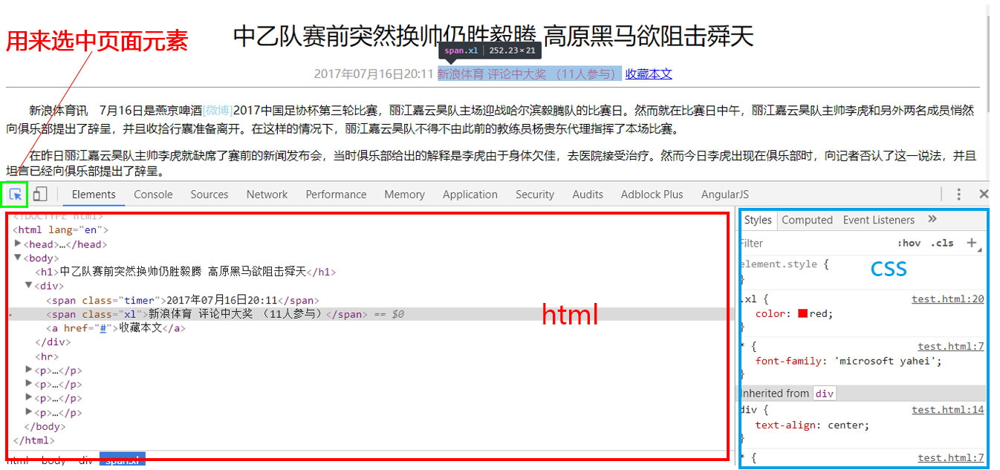

# CSS字体样式属性调试工具

 目标

- 应用
  - 使用css字体样式完成对字体的设置
  - 使用css外观属性给页面元素添加样式
  - 使用常用的emmet语法
  - 能够使用开发人员工具代码调试

# 1.font字体

## 1.1 font-size:大小

- 作用：

  font-size属性用于设置字号

~~~css
p {  
    font-size:20px; 
}
~~~

- 单位：

  - 可以使用相对长度单位，也可以使用绝对长度单位。
  - 相对长度单位比较常用，推荐使用像素单位px，绝对长度单位使用较少。


**注意：**

* 我们文字大小以后，基本就用px了，其他单位很少使用
* 谷歌浏览器默认的文字大小为16px
* 但是不同浏览器可能默认显示的字号大小不一致，我们尽量给一个明确值大小，不要默认大小。一般给body指定整个页面文字的大小

## 1.2 font-family:字体

- 作用：

  font-family属性用于设置哪一种字体。

~~~
p{ font-family:"微软雅黑";}
~~~

- 网页中常用的字体有宋体、微软雅黑、黑体等，例如将网页中所有段落文本的字体设置为微软雅黑
- 可以同时指定多个字体，中间以逗号隔开，表示如果浏览器不支持第一个字体，则会尝试下一个，直到找到合适的字体， 如果都没有，则以我们电脑默认的字体为准。

~~~
p{font-family: Arial,"Microsoft Yahei", "微软雅黑";}
~~~

> 常用技巧：

```
1. 各种字体之间必须使用英文状态下的逗号隔开。
2. 中文字体需要加英文状态下的引号，英文字体一般不需要加引号。当需要设置英文字体时，英文字体名必须位于中文字体名之前。
3. 如果字体名中包含空格、#、$等符号，则该字体必须加英文状态下的单引号或双引号，例如font-family: "Times New Roman";。
4. 尽量使用系统默认字体，保证在任何用户的浏览器中都能正确显示。
```

### CSS Unicode字体


- 为什么使用 Unicode字体

  - 在 CSS 中设置字体名称，直接写中文是可以的。但是在文件编码（GB2312、UTF-8 等）不匹配时会产生乱码的错误。
  - xp 系统不支持 类似微软雅黑的中文。

- 解决：

  - 方案一： 你可以使用英文来替代。 比如` font-family:"Microsoft Yahei"`。

  - 方案二： 在 CSS 直接使用 Unicode 编码来写字体名称可以避免这些错误。使用 Unicode 写中文字体名称，浏览器是可以正确的解析的。

    ~~~
    font-family: "\5FAE\8F6F\96C5\9ED1";   表示设置字体为“微软雅黑”。
    ~~~

| 字体名称      | 英文名称            | Unicode 编码           |
| --------- | --------------- | -------------------- |
| 宋体        | SimSun          | \5B8B\4F53           |
| 新宋体       | NSimSun         | \65B0\5B8B\4F53      |
| 黑体        | SimHei          | \9ED1\4F53           |
| 微软雅黑      | Microsoft YaHei | \5FAE\8F6F\96C5\9ED1 |
| 楷体_GB2312 | KaiTi_GB2312    | \6977\4F53_GB2312    |
| 隶书        | LiSu            | \96B6\4E66           |
| 幼园        | YouYuan         | \5E7C\5706           |
| 华文细黑      | STXihei         | \534E\6587\7EC6\9ED1 |
| 细明体       | MingLiU         | \7EC6\660E\4F53      |
| 新细明体      | PMingLiU        | \65B0\7EC6\660E\4F53 |

为了照顾不同电脑的字体安装问题，我们尽量只使用宋体和微软雅黑中文字体

## 1.3 font-weight:字体粗细

- 在html中如何将字体加粗我们可以用标签来实现
  - 使用`b`和`strong`标签是文本加粗。
- 可以使用CSS 来实现，但是CSS 是没有语义的。

| 属性值  | 描述                                                      |
| ------- | :-------------------------------------------------------- |
| normal  | 默认值（不加粗的）                                        |
| bold    | 定义粗体（加粗的）                                        |
| 100~900 | 400 等同于 normal，而700等同于bold我们重点记住这句话 |

提倡：

  我们平时更喜欢用数字来表示加粗和不加粗。

## 1.4 font-style:字体风格

- 在html中如何将字体倾斜我们可以用标签来实现
  - 字体倾斜除了用i和em标签，
- 可以使用CSS来实现，但是CSS是没有语义的

font-style属性用于定义字体风格，如设置斜体、倾斜或正常字体，其可用属性值如下：

| 属性   | 作用                                                    |
| ------ | :------------------------------------------------------ |
| normal | 默认值，浏览器会显示标准的字体样式  font-style: normal; |
| italic | 浏览器会显示斜体的字体样式。                            |

小技巧： 

```
平时我们很少给文字加斜体，反而喜欢给斜体标签（em，i）改为普通模式。
```

## 1.5 font:综合设置字体样式 (重点)

font属性用于对字体样式进行综合设置

- 基本语法格式如下：

```css
选择器 { font: font-style  font-weight  font-size/line-height  font-family;}
```

- 注意：
  - 使用font属性时，必须按上面语法格式中的顺序书写，不能更换顺序，各个属性以**空格**隔开。
  - 其中不需要设置的属性可以省略（取默认值），但必须保留font-size和font-family属性，否则font属性将不起作用。

## 1.6 font总结
| 属性                          |      表示      |      注意点      |
| :---------------------------- | :-------------  | :------------- |
| font-size     | 字号 |我们通常用的单位是px 像素，一定要跟上单位|
| font-family     |    字体    |实际工作中按照团队约定来写字体|
| font-weight |  字体粗细 |记住加粗是 700 或者 bold  不加粗 是 normal 或者  400  记住数字不要跟单位|
| font-style | 字体样式 |记住倾斜是 italic     不倾斜 是 normal  工作中我们最常用 normal|
| font | 字体连写 |1. 字体连写是有顺序的  不能随意换位置 2. 其中字号 和 字体 必须同时出现|

# 2. CSS外观属性

## 2.1 color:文本颜色

- 作用：

  color属性用于定义文本的颜色，

- 其取值方式有如下3种：

| 表示表示       | 属性值                                  |
| :------------- | :-------------------------------------- |
| 预定义的颜色值 | red，green，blue，还有我们的御用色 pink |
| 十六进制       | #FF0000，#FF6600，#29D794               |
| RGB代码        | rgb(255,0,0)或rgb(100%,0%,0%)           |

- 注意

  我们实际工作中，用16进制的写法是最多的，而且我们更喜欢简写方式比如`#f00`代表红色

## 2.2 text-align:文本水平对齐方式

- 作用：

  text-align属性用于设置文本内容的水平对齐，相当于html中的align对齐属性

- 其可用属性值如下：

| 属性   |       解释       |
| ------ | :--------------: |
| left   | 左对齐（默认值） |
| right  |      右对齐      |
| center |     居中对齐     |

- 注意：

  是让盒子里面的内容水平居中， 而不是让盒子居中对齐

## 2.3 line-height:行间距

- 作用：

  line-height属性用于设置行间距，就是行与行之间的距离，即字符的垂直间距，一般称为行高。

- 单位：

  - line-height常用的属性值单位有三种，分别为像素px，相对值em和百分比%，实际工作中使用最多的是像素px

- 技巧：

```
一般情况下，行距比字号大7.8像素左右就可以了。
line-height: 24px;
```

## 2.4 text-indent:首行缩进

- 作用：

  text-indent属性用于设置首行文本的缩进，

- 属性值

  - 其属性值可为不同单位的数值、em字符宽度的倍数、或相对于浏览器窗口宽度的百分比%，允许使用负值,
  - 建议使用em作为设置单位。

**1em 就是一个字的宽度，如果是汉字的段落，1em 就是一个汉字的宽度**

~~~css
p {
      /*行间距*/
      line-height: 25px;
      /*首行缩进2个字  em  1个em 就是1个字的大小*/
      text-indent: 2em;  
 }
~~~

## 2.5 text-decoration 文本的装饰

text-decoration   通常我们用于给链接修改装饰效果

| 值           | 描述                                                  |
| ------------ | ----------------------------------------------------- |
| none         | 默认。定义标准的文本。 取消下划线（最常用）           |
| underline    | 定义文本下的一条线。下划线 也是我们链接自带的（常用） |
| overline     | 定义文本上的一条线。（不用）                          |
| line-through | 定义穿过文本下的一条线。（不常用）                    |

## 2.6 CSS外观属性总结

| 属性                          |      表示      |      注意点      |
| :---------------------------- | :-------------  | :------------- |
| color | 颜色 |我们通常用  十六进制   比如 而且是简写形式 #fff|
| line-height |    行高    |控制行与行之间的距离|
| text-align | 水平对齐 |可以设定文字水平的对齐方式|
| text-indent | 首行缩进 |通常我们用于段落首行缩进2个字的距离   text-indent: 2em;|
| text-decoration | 文本修饰 |记住 添加 下划线  underline  取消下划线  none|

# 3.开发者工具（chrome）

**此工具是我们的必备工具，以后代码出了问题**

**我们首先第一反应就是：**

- “按F12”或者是“shift+ctrl+i”打开开发者工具。
- 菜单：右击网页空白出---检查



- 通过开发人员工具小指针工具，查找页面元素
- 左侧是html页面结构，右侧是css样式

小技巧：

1. ctrl+滚轮 可以 放大开发者工具代码大小。
2. 左边是HTML元素结构，右边是CSS样式。
3. 右边CSS样式可以改动数值和颜色查看更改后效果。
4. ctrl + 0复原浏览器大小


# 4. sublime快捷操作emmet语法

Emmet的前身是Zen coding,它使用缩写,来提高html/css的编写速度。

1. 生成标签 直接输入标签名 按tab键即可比如div，然后tab 键，就可以生成`<div></div>` 

2. 如果想要生成多个相同标签  加上`*`就可以了 比如div*3就可以快速生成3个div

3. 如果有父子级关系的标签，可以用>比如ul > li就可以了

4. 如果有兄弟关系的标签，用+就可以了。比如 div+p  

5. 如果生成带有类名或者id名字的，直接写.demo或者#two tab 键就可以了

6. 如果生成的div类名是有顺序的，可以用自增符号  $     

   ~~~
   .demo$*3        
   <div class="demo1"></div>
   <div class="demo2"></div>
   <div class="demo3"></div>
   ~~~

    

# 5. 综合案例


# 6. 今日总结


# 7. 拓展阅读@

[emmet语法](https://www.w3cplus.com/tools/emmet-cheat-sheet.html)

# 8. CSS属性书写顺序（重点）
建议遵循以下顺序：

1. 布局定位属性：display / position / float / clear / visibility / overflow（建议 display 第一个写，毕竟关系到模式）
2. 自身属性：width / height / margin / padding / border / background
3. 文本属性：color / font / text-decoration / text-align / vertical-align / white- space / break-word
4. 其他属性（CSS3）：content / cursor / border-radius / box-shadow / text-shadow / background:linear-gradient …

```css
.jdc {
    display: block;
    position: relative;
    float: left;
    width: 100px;
    height: 100px;
    margin: 0 10px;
    padding: 20px 0;
    font-family: Arial, 'Helvetica Neue', Helvetica, sans-serif;
    color: #333;
    background: rgba(0,0,0,.5);
    -webkit-border-radius: 10px;
    -moz-border-radius: 10px;
    border-radius: 10px;
}
```

# 9. 布局流程

为了提高网页制作的效率，布局时通常有以下的布局流程，具体如下：

1、必须确定页面的版心（可视区，我们测量可得知。

2、分析页面中的行模块，以及每个行模块中的列模块。其实页面布局，就是一行行罗列而成

3、制作HTML结构。我们还是遵循，先有结构，后有样式的原则。结构永远最重要。

4、然后开始运用盒子模型的原理，通过DIV+CSS布局来控制网页的各个模块。