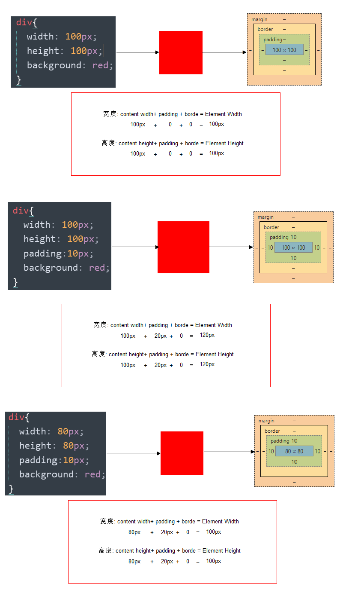
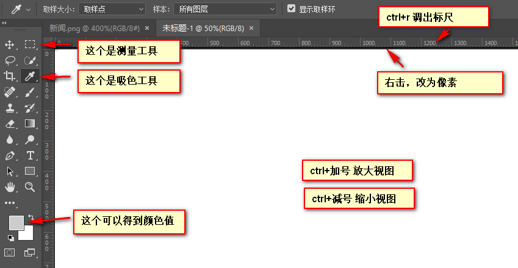

> 第01阶段.前端基础.盒子模型
# 盒子模型（CSS重点）

css学习三大重点： css 盒子模型   、  浮动  、  定位  

主题思路：


目标： 

- 理解：
  - 能说出盒子模型有那四部分组成
  - 能说出内边距的作用以及对盒子的影响
  - 能说出padding设置不同数值个数分别代表的意思
  - 能说出块级盒子居中对齐需要的2个条件
  - 能说出外边距合并的解决方法
- 应用：
  - 能利用边框复合写法给元素添加边框
  - 能计算盒子的实际大小
  - 能利用盒子模型布局模块案例

## 1.看透网页布局的本质

网页布局中，我们是如何把里面的文字，图片，按照美工给我们的效果图排列的整齐有序呢？


- 看透网页布局的本质：
  -  首先利用CSS设置好盒子的大小，然后摆放盒子的位置。
  -  最后把网页元素比如文字图片等等，放入盒子里面。
  - 以上两步 就是网页布局的本质

 

我们明白了，盒子是网页布局的关键点，所以我们更应该弄明白 这个盒子有什么特点。

## 2. 盒子模型（Box Model）

- 所谓盒子模型：

  - 就是把HTML页面中的布局元素看作是一个矩形的盒子，也就是一个盛装内容的容器。

  

   

  **pink老师总结：**

  * 盒子模型有元素的内容、边框（border）、内边距（padding）、和外边距（margin）组成。
  * 盒子里面的文字和图片等元素是 内容区域
  * 盒子的厚度 我们成为 盒子的边框 
  * 盒子内容与边框的距离是内边距（类似单元格的 cellpadding)
  * 盒子与盒子之间的距离是外边距（类似单元格的 cellspacing）

**标准盒子模型**


 

## 3. 盒子边框（border） 

​	

- 语法：

~~~css
border : border-width || border-style || border-color 
~~~

| 属性         |          作用          |
| ------------ | :--------------------: |
| border-width | 定义边框粗细，单位是px |
| border-style |       边框的样式       |
| border-color |        边框颜色        |

- 边框的样式：
  - none：没有边框即忽略所有边框的宽度（默认值）
  - solid：边框为单实线(最为常用的)
  - dashed：边框为虚线  
  - dotted：边框为点线

### 3.1 边框综合设置

```
border : border-width || border-style || border-color 
```

例如：

~~~css
 border: 1px solid red;  没有顺序  
~~~


### 3.2 盒子边框写法总结表

很多情况下，我们不需要指定4个边框，我们是可以单独给4个边框分别指定的。

| 上边框                     | 下边框                        | 左边框                      | 右边框                       |
| :------------------------- | :---------------------------- | :-------------------------- | :--------------------------- |
| border-top-style:样式;     | border-bottom-style:样式;     | border-left-style:样式;     | border-right-style:样式;     |
| border-top-width:宽度;     | border- bottom-width:宽度;    | border-left-width:宽度;     | border-right-width:宽度;     |
| border-top-color:颜色;     | border- bottom-color:颜色;    | border-left-color:颜色;     | border-right-color:颜色;     |
| border-top:宽度 样式 颜色; | border-bottom:宽度 样式 颜色; | border-left:宽度 样式 颜色; | border-right:宽度 样式 颜色; |

### 3.3 表格的细线边框

 

- 通过表格的`cellspacing="0"`,将单元格与单元格之间的距离设置为0，

- 但是两个单元格之间的边框会出现重叠，从而使边框变粗

- 通过css属性：

  ~~~
  table{ border-collapse:collapse; }  
  ~~~

  - collapse 单词是合并的意思
  - border-collapse:collapse; 表示相邻边框合并在一起。

~~~css
<style>
	table {
		width: 500px;
		height: 300px;
		border: 1px solid red;
	}
	td {
		border: 1px solid red;
		text-align: center;
	}
	table, td {
		border-collapse: collapse;  /*合并相邻边框*/
	}
</style>
~~~

 

## 4. 内边距（padding）

 

### 4.1 内边距：

​	padding属性用于设置内边距。 **是指 边框与内容之间的距离。**

### 4.2 设置

| 属性          | 作用     |
| ------------- | :------- |
| padding-left  | 左内边距 |
| padding-right | 右内边距 |
| padding-top   | 上内边距 |
| padding-bottom   | 下内边距 |

当我们给盒子指定padding值之后， 发生了2件事情：

1. 内容和边框 有了距离，添加了内边距。
2. 盒子会变大了。

 **注意：  后面跟几个数值表示的意思是不一样的。**

我们分开写有点麻烦，我们可以不可以简写呢？

| 值的个数 | 表达意思                                        |
| -------- | ----------------------------------------------- |
| 1个值    | padding：上下左右内边距;                        |
| 2个值    | padding: 上下内边距    左右内边距 ；            |
| 3个值    | padding：上内边距   左右内边距   下内边距；     |
| 4个值    | padding: 上内边距 右内边距 下内边距 左内边距 ； |


**课堂一练：**

请写出如下内边距：

1. 要求盒子有一个左边内边距是 5像素
2. 要求简写的形式写出  一个盒子上下是 25像素   左右是15像素。
3. 要求简写的形式写出 一个盒子  上内边距是 12像素  下内边距是 0  左内边距是 25像素  右内边距是 10像素

### 4.3 课堂案例：  新浪导航

新浪导航栏的核心就是因为里面的字数不一样多，所以我们不方便给宽度，还是给padding ，撑开盒子的。

 

### 4.4 内盒尺寸计算（元素实际大小）


- 宽度

  Element Height = content height + padding + border （Height为内容高度）

- 高度

   Element Width = content width + padding + border （Width为内容宽度）

-  盒子的实际的大小 =   内容的宽度和高度 +  内边距   +  边框   

### 4.5 内边距产生的问题

- 问题

  

  会撑大原来的盒子

- 解决：

  通过给设置了宽高的盒子，减去相应的内边距的值，维持盒子原有的大小

  


**课堂一练**

1. 一个盒子宽度为100， padding为 10， 边框为5像素，问这个盒子实际的宽度的是（）

- [x] (A) 130

- [ ] (B) 135 

- [ ] (C) 125

- [ ] (D) 115

  100 +  20 + 10 

2. 关于根据下列代码计算 盒子宽高下列说法正确的是（）

```css
div {

		width: 200px;

         height: 200px;

		border: 1px solid #000000;

		border-top: 5px solid blue;

		padding: 50px;

		padding-left: 100px;

		}
```

- [ ] (A) 宽度为200px 高度为200px
- [x] (B) 宽度为352px 高度为306px
- [ ] (C) 宽度为302px 高度为307px
- [ ] (D) 宽度为302px 高度为252px

w  200 +   150   + 2   =  352

h   200 +  100 +  6   =  306 

### 4.6 padding不影响盒子大小情况

> 如果没有给一个盒子指定宽度， 此时，如果给这个盒子指定padding， 则不会撑开盒子。

## 5. 外边距（margin）


### 5.1 外边距

​	margin属性用于设置外边距。  margin就是控制**盒子和盒子之间的距离**

### 5.2 设置：

| 属性          | 作用     |
| ------------- | :------- |
| margin-left   | 左外边距 |
| margin-right  | 右外边距 |
| margin-top    | 上外边距 |
| margin-bottom | 下外边距 |

margin值的简写 （复合写法）代表意思  跟 padding 完全相同。

### 5.3 块级盒子水平居中

- 可以让一个块级盒子实现水平居中必须：
  - 盒子必须指定了宽度（width）
  - 然后就给**左右的外边距都设置为auto**，

实际工作中常用这种方式进行网页布局，示例代码如下：

~~~css
.header{ width:960px; margin:0 auto;}
~~~

常见的写法，以下下三种都可以。

* margin-left: auto;   margin-right: auto;
* margin: auto;
* margin: 0 auto;

### 5.4 文字居中和盒子居中区别

1.  盒子内的文字水平居中是  text-align: center,  而且还可以让 行内元素和行内块居中对齐
2.  块级盒子水平居中  左右margin 改为 auto 

~~~css
text-align: center; /*  文字 行内元素 行内块元素水平居中 */
margin: 10px auto;  /* 块级盒子水平居中  左右margin 改为 auto 就阔以了 上下margin都可以 */
~~~

### 5.5 插入图片和背景图片区别

1. 插入图片 我们用的最多 比如产品展示类  移动位置只能靠盒模型 padding margin
4. 背景图片我们一般用于小图标背景 或者 超大背景图片  背景图片 只能通过  background-position

~~~css
 img {  
		width: 200px;/* 插入图片更改大小 width 和 height */
		height: 210px;
		margin-top: 30px;  /* 插入图片更改位置 可以用margin 或padding  盒模型 */
		margin-left: 50px; /* 插入当图片也是一个盒子 */
	}

 div {
		width: 400px;
		height: 400px;
		border: 1px solid purple;
		background: #fff url(images/sun.jpg) no-repeat;
		background-position: 30px 50px; /* 背景图片更改位置 我用 background-position */
	}
~~~

### 5.6 清除元素的默认内外边距(重要)


为了更灵活方便地控制网页中的元素，制作网页时，我们需要将元素的默认内外边距清除

代码： 

~~~css
* {
   padding:0;         /* 清除内边距 */
   margin:0;          /* 清除外边距 */
}
~~~

注意：  

* 行内元素为了照顾兼容性， 尽量只设置左右内外边距， 不要设置上下内外边距。

### 5.7 外边距合并

使用margin定义块元素的**垂直外边距**时，可能会出现外边距的合并。

#### (1). 相邻块元素垂直外边距的合并

- 当上下相邻的两个块元素相遇时，如果上面的元素有下外边距margin-bottom
- 下面的元素有上外边距margin-top，则他们之间的垂直间距不是margin-bottom与margin-top之和
- **取两个值中的较大者**这种现象被称为相邻块元素垂直外边距的合并（也称外边距塌陷）。

 

**解决方案：尽量给只给一个盒子添加margin值**。

#### (2). 嵌套块元素垂直外边距的合并（塌陷）

- 对于两个嵌套关系的块元素，如果父元素没有上内边距及边框
- 父元素的上外边距会与子元素的上外边距发生合并
- 合并后的外边距为两者中的较大者

 

**解决方案：**

1. 可以为父元素定义上边框。
2. 可以为父元素定义上内边距
2. 可以为父元素添加overflow:hidden。

还有其他方法，比如浮动、固定、绝对定位的盒子不会有问题，后面咱们再总结。。。

## 6. 盒子模型布局稳定性

- 学习完盒子模型，内边距和外边距，什么情况下用内边距，什么情况下用外边距？

  - 大部分情况下是可以混用的。  就是说，你用内边距也可以，用外边距也可以。 你觉得哪个方便，就用哪个。

我们根据稳定性来分，建议如下：

按照 优先使用  宽度 （width）  其次 使用内边距（padding）    再次  外边距（margin）。   

```
  width >  padding  >   margin   
```

- 原因：
  - margin 会有外边距合并 还有 ie6下面margin 加倍的bug（讨厌）所以最后使用。
  - padding  会影响盒子大小， 需要进行加减计算（麻烦） 其次使用。
  - width   没有问题（嗨皮）我们经常使用宽度剩余法 高度剩余法来做。

## 7. ps基本操作以及常用快捷键：

因为网页美工大部分效果图都是利用ps 来做的，所以，以后我们大部分切图工作都是在ps里面完成。

- 文件--打开 --  可以打开 我们要测量的图片
- ctrl+r 可以打开标尺  或者  视图 --  标尺
- 右击标尺，  把里面的单位改为  像素  
- ctrl+ 加号 键  可以 放大  视图  ctrl+ 减号 缩小视图
- 按住空格键，  鼠标可以 变成小手 ，拖动 ps 视图
- 用选区 拖动  可以 测量 大小 
- ctrl+ d  可以取消选区  或者旁边空白处点击一下也可以取消选区



## 8. 综合案例


#### 去掉列表默认的样式

无序和有序列表前面默认的列表样式，在不同浏览器显示效果不一样，而且也比较难看，所以，我们一般上来就直接去掉这些列表样式就行了。 代码如下

~~~css
li { list-style: none; }
~~~


## 9. 今日总结


# 拓展@

以下我们讲的CSS3部分新属性， 但是我们遵循的原则是，以下内容，不会影响我们页面布局， 只是样式更好看了而已。

## 1.圆角边框(CSS3)


- 语法：

```css
border-radius:length;  
```

- 其中每一个值可以为 数值或百分比的形式。 

- 技巧： 让一个正方形  变成圆圈 

  ~~~
  border-radius: 50%;
  ~~~

 

* 
* 以上效果图矩形的圆角， 就不要用 百分比了，因为百分比会是表示高度和宽度的一半。
* 而我们这里矩形就只用 用 高度的一半就好了。精确单位。

## 2. 盒子阴影(CSS3)


- 语法:

~~~css
box-shadow:水平阴影 垂直阴影 模糊距离（虚实）  阴影尺寸（影子大小）  阴影颜色  内/外阴影；
~~~


- 前两个属性是必须写的。其余的可以省略。
- 外阴影 (outset) 是默认的 但是不能写           想要内阴影可以写  inset 

~~~css
div {
			width: 200px;
			height: 200px;
			border: 10px solid red;
			/* box-shadow: 5px 5px 3px 4px rgba(0, 0, 0, .4);  */
			/* box-shadow:水平位置 垂直位置 模糊距离 阴影尺寸（影子大小） 阴影颜色  内/外阴影； */
			box-shadow: 0 15px 30px  rgba(0, 0, 0, .4);
			
}
~~~

# CSS书写规范

开始就形成良好的书写规范，是你专业的开始。

## 空格规范

【强制】 选择器 与 { 之间必须包含空格。

示例： 

~~~css
.selector {
}
~~~

【强制】 属性名 与之后的 : 之间不允许包含空格， : 与 属性值 之间必须包含空格。

示例：

~~~css
font-size: 12px;
~~~

## 选择器规范

【强制】 并集选择器，每个选择器声明必须独占一行。

示例：

```
/* good */
.post,
.page,
.comment {
    line-height: 1.5;
}


/* bad */
.post, .page, .comment {
    line-height: 1.5;
}
```

【建议】 一般情况情况下，选择器的嵌套层级应不大于 3 级，位置靠后的限定条件应尽可能精确。

示例：

```css
/* good */
#username input {}
.comment .avatar {}

/* bad */
.page .header .login  input {}
.comment div * {}
```

## 属性规范

【强制】 属性定义必须另起一行。

示例：

```css
/* good */
.selector {
    margin: 0;
    padding: 0;
}

/* bad */
.selector { margin: 0; padding: 0; }
```

【强制】 属性定义后必须以分号结尾。

示例：

```css
/* good */
.selector {
    margin: 0;
}

/* bad */
.selector {
    margin: 0
}
```

