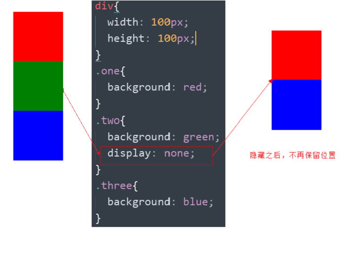
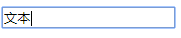
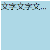
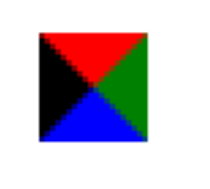

# CSS高级技巧

**目标**

* 理解
  * 能说出元素显示隐藏最常见的写法
  * 能说出精灵图产生的目的
  * 能说出去除图片底侧空白缝隙的方法
* 应用
  * 能写出最常见的鼠标样式
  * 能使用精灵图技术
  * 能用滑动门做导航栏案例

## 1. 元素的显示与隐藏

- 目的

  让一个元素在页面中消失或者显示出来

- 场景

  类似网站广告，当我们点击关闭就不见了，但是我们重新刷新页面，会重新出现！

### 1.1 display 显示（重点）

- display 设置或检索对象是否及如何显示。

  ~~~
  display: none 隐藏对象

  display：block 除了转换为块级元素之外，同时还有显示元素的意思。
  ~~~

- 特点： 隐藏之后，不再保留位置。



实际开发场景：

> 配合后面js做特效，比如下拉菜单，原先没有，鼠标经过，显示下拉菜单， 应用极为广泛

### 1.2 visibility 可见性 (了解)

- 设置或检索是否显示对象。

  ~~~
  visibility：visible ; 　对象可视

  visibility：hidden; 　  对象隐藏
  ~~~

- 特点： 隐藏之后，继续保留原有位置。（停职留薪）


### 1.3 overflow 溢出(重点)

- 检索或设置当对象的内容超过其指定高度及宽度时如何管理内容。


| 属性值      | 描述                                       |
| ----------- | ------------------------------------------ |
| **visible** | 不剪切内容也不添加滚动条                   |
| **hidden**  | 不显示超过对象尺寸的内容，超出的部分隐藏掉 |
| **scroll**  | 不管超出内容否，总是显示滚动条             |
| **auto**    | 超出自动显示滚动条，不超出不显示滚动条     |

 

实际开发场景：

1. 清除浮动
2. 隐藏超出内容，隐藏掉,  不允许内容超过父盒子。

###  1.4 显示与隐藏总结

| 属性           | 区别                   | 用途                                                         |
| -------------- | ---------------------- | ------------------------------------------------------------ |
| **display**    | 隐藏对象，不保留位置   | 配合后面js做特效，比如下拉菜单，原先没有，鼠标经过，显示下拉菜单， 应用极为广泛 |
| **visibility** | 隐藏对象，保留位置     | 使用较少                                                     |
| **overflow**   | 只是隐藏超出大小的部分 | 1. 可以清除浮动 2. 保证盒子里面的内容不会超出该盒子范围                                   |
## 2. CSS用户界面样式

- 所谓的界面样式， 就是更改一些用户操作样式，以便提高更好的用户体验。
  - 更改用户的鼠标样式 (滚动条因为兼容性非常差，我们不研究) 
  - 表单轮廓等。
  -  防止表单域拖拽

### 2.1 鼠标样式cursor

 设置或检索在对象上移动的鼠标指针采用何种系统预定义的光标形状。

| 属性值          | 描述       |
| --------------- | ---------- |
| **default**     | 小白  默认 |
| **pointer**     | 小手       |
| **move**        | 移动       |
| **text**        | 文本       |
| **not-allowed** | 禁止       |


```html
<ul>
  <li style="cursor:default">我是小白</li>
  <li style="cursor:pointer">我是小手</li>
  <li style="cursor:move">我是移动</li>
  <li style="cursor:text">我是文本</li>
  <li style="cursor:not-allowed">我是文本</li>
</ul>  
```

### 2.2 轮廓线 outline



 是绘制于元素周围的一条线，位于边框边缘的外围，可起到突出元素的作用。 

```html
 outline : outline-color ||outline-style || outline-width 
```

 但是我们都不关心可以设置多少，我们平时都是去掉的。  

最直接的写法是 ：outline: 0; 或者：outline: none;

```html
 <input  type="text"  style="outline: 0;"/>
```

### 2.3 防止拖拽文本域resize


实际开发中，我们文本域右下角是不可以拖拽： 

```html
<textarea  style="resize: none;"></textarea>
```

### 2.4 用户界面样式总结

| 属性         | 用途                 | 用途                                                         |
| ------------ | -------------------- | ------------------------------------------------------------ |
| **鼠标样式** | 更改鼠标样式cursor   | 样式很多，重点记住 pointer                                   |
| **轮廓线**   | 表单默认outline      | outline 轮廓线，我们一般直接去掉，border是边框，我们会经常用 |
| 防止拖拽     | 主要针对文本域resize | 防止用户随意拖拽文本域，造成页面布局混乱，我们resize:none    |
## 3. vertical-align 垂直对齐

- 有宽度的块级元素居中对齐，是margin: 0 auto;
- 让文字居中对齐，是 text-align: center;

但是我们从来没有讲过有垂直居中的属性。

vertical-align 垂直对齐，它只针对于**行内元素**或者**行内块元素**，


```html
vertical-align : baseline |top |middle |bottom 
```

设置或检索对象内容的垂直对其方式。

- 注意：

  vertical-align 不影响块级元素中的内容对齐，它只针对于**行内元素**或者**行内块元素**，

  特别是行内块元素， **通常用来控制图片/表单与文字的对齐**。

### 3.1 图片、表单和文字对齐

所以我们知道，我们可以通过vertical-align 控制图片和文字的垂直关系了。 默认的图片会和文字基线对齐。

 


### 3.2 去除图片底侧空白缝隙


- 原因：

  图片或者表单等行内块元素，他的底线会和父级盒子的基线对齐。

  就是图片底侧会有一个空白缝隙。

- 解决的方法就是：  

  - 给img vertical-align:middle | top| bottom等等。  让图片不要和基线对齐。

    ​

  - 给img 添加 display：block; 转换为块级元素就不会存在问题了。

##  4. 溢出的文字省略号显示

###  4.1 white-space

- white-space设置或检索对象内文本显示方式。通常我们使用于强制一行显示内容 

~~~
white-space:normal ；默认处理方式

white-space:nowrap ；　强制在同一行内显示所有文本，直到文本结束或者遭遇br标签对象才换行。
~~~

###  4.2 text-overflow 文字溢出

- 设置或检索是否使用一个省略标记（...）标示对象内文本的溢出

~~~
text-overflow : clip ；不显示省略标记（...），而是简单的裁切 

text-overflow：ellipsis ； 当对象内文本溢出时显示省略标记（...）
~~~

**注意**：

一定要首先强制一行内显示，再次和overflow属性  搭配使用



### 4.3 总结三步曲

~~~css
style {
  /*1. 先强制一行内显示文本*/
      white-space: nowrap;
  /*2. 超出的部分隐藏*/
      overflow: hidden;
  /*3. 文字用省略号替代超出的部分*/
      text-overflow: ellipsis;
}
~~~

##  5. CSS精灵技术（sprite) 重点

###  5.1 为什么需要精灵技术


图所示为网页的请求原理图，当用户访问一个网站时，需要向服务器发送请求，网页上的每张图像都要经过一次请求才能展现给用户。

然而，一个网页中往往会应用很多小的背景图像作为修饰，当网页中的图像过多时，服务器就会频繁地接受和发送请求，这将大大降低页面的加载速度。

**pink老师告诉你我们为什么需要精灵技术：**

>  **为了有效地减少服务器接受和发送请求的次数，提高页面的加载速度。**

出现了CSS精灵技术（也称CSS Sprites、CSS雪碧）。

### 5.2 精灵技术讲解

CSS 精灵其实是将网页中的一些背景图像整合到一张大图中（精灵图），然而，各个网页元素通常只需要精灵图中不同位置的某个小图，要想精确定位到精灵图中的某个小图。


这样，当用户访问该页面时，只需向服务发送一次请求，网页中的背景图像即可全部展示出来。

我们需要使用CSS的

* background-image
* background-repeat
* background-position属性进行背景定位
* 其中最关键的是使用background-position 属性精确地定位。

### 5.3 精灵技术使用的核心总结

首先我们知道，css精灵技术主要针对于背景图片，插入的图片img 是不需要这个技术的。

1. 精确测量，每个小背景图片的大小和 位置。
2. 给盒子指定小背景图片时， 背景定位基本都是 负值。

### 5.4 制作精灵图(了解)

CSS 精灵其实是将网页中的一些背景图像整合到一张大图中（精灵图），那我们要做的，就是把小图拼合成一张大图。

大部分情况下，精灵图都是网页美工做。

> 我们精灵图上放的都是小的装饰性质的背景图片。 插入图片不能往上放。
我们可以横向摆放也可以纵向摆放，但是每个图片之间留有适当的空隙
在我们精灵图的最低端，留一片空隙，方便我们以后添加其他精灵图。

结束语：小公司，背景图片很少的情况，没有必要使用精灵技术，维护成本太高。 如果是背景图片比较多，可以建议使用精灵技术。

##  6. 滑动门

先来体会下现实中的滑动门,或者你可以叫做推拉门：


###  滑动门出现的背景

制作网页时，为了美观，常常需要为网页元素设置特殊形状的背景，比如微信导航栏，有凸起和凹下去的感觉，最大的问题是里面的字数不一样多，咋办？


为了使各种特殊形状的背景能够自适应元素中文本内容的多少，出现了CSS滑动门技术。它从新的角度构建页面，使各种特殊形状的背景能够自由拉伸滑动，以适应元素内部的文本内容，可用性更强。 最常见于各种导航栏的滑动门。

http://weixin.qq.com/

###  核心技术

核心技术就是利用CSS精灵（主要是背景位置）和 盒子padding撑开宽度, 以便能适应不同字数的导航栏。

一般的经典布局都是这样的：

```html
<li>
  <a href="#">
    <span>导航栏内容</span>
  </a>
</li>
```

css样式

~~~css
* {
      padding:0;
      margin:0;

    }
    body{
      background: url(images/wx.jpg) repeat-x;
    }
    .father {
      padding-top:20px;
    }
    li {
      padding-left: 16px;
      height: 33px;
      float: left;
      line-height: 33px;
      margin:0  10px;
      background: url(./images/to.png) no-repeat left ;
    }
    a {
      padding-right: 16px;
      height: 33px;
      display: inline-block;
      color:#fff;
      background: url(./images/to.png) no-repeat right ;
      text-decoration: none;
    }
    li:hover,
     li:hover a {
      background-image:url(./images/ao.png);
    }
~~~


总结： 

1. a 设置 背景左侧，padding撑开合适宽度。    
2. span 设置背景右侧， padding撑开合适宽度 剩下由文字继续撑开宽度。
3. 之所以a包含span就是因为 整个导航都是可以点击的。


## 7. 拓展@

### 7.1 margin负值之美

#### 1). 负边距+定位：水平垂直居中

咱们前面讲过， 一个绝对定位的盒子， 利用  父级盒子的 50%，  然后 往左(上) 走 自己宽度的一半 ，可以实现盒子水平垂直居中。

#### 2). 压住盒子相邻边框 


### 7.2 CSS三角形之美

~~~css
 div {

 	width: 0; 

    height: 0;
    line-height:0;
    font-size: 0;
	border-top: 10px solid red;

	border-right: 10px solid green;

	border-bottom: 10px solid blue;

	border-left: 10px solid #000; 

 }

~~~

一张图， 你就知道 css 三角是怎么来的了, 做法如下：

 

1. 我们用css 边框可以模拟三角效果
2. 宽度高度为0
3. 我们4个边框都要写， 只保留需要的边框颜色，其余的不能省略，都改为 transparent 透明就好了
4. 为了照顾兼容性 低版本的浏览器，加上 font-size: 0;  line-height: 0;

### 7.3 过渡(CSS3)

过渡（transition)是CSS3中具有颠覆性的特征之一，我们可以在不使用 Flash 动画或 JavaScript 的情况下，当元素从一种样式变换为另一种样式时为元素添加效果。

过渡动画：是从一个状态 渐渐的过渡到另外一个状态

可以让我们页面更好看，更动感十足，虽然低版本浏览器不支持（ie9以下版本），但是不会影响页面布局。

我们现在经常和`:hover`一起搭配使用。

语法格式:

```
transition: 要过渡的属性  花费时间  运动曲线  何时开始;
```

| 属性                       | 描述                                         | CSS  |
| -------------------------- | -------------------------------------------- | ---- |
| transition                 | 简写属性，用于在一个属性中设置四个过渡属性。 | 3    |
| transition-property        | 规定应用过渡的 CSS 属性的名称。              | 3    |
| transition-duration        | 定义过渡效果花费的时间。默认是 0。           | 3    |
| transition-timing-function | 规定过渡效果的时间曲线。默认是 "ease"。      | 3    |
| transition-delay           | 规定过渡效果何时开始。默认是 0。             | 3    |

* 属性

​    属性就是你想要变化的 css 属性， 宽度,高度,背景颜色,内外边距都可以 。如果想要所有的属性都变化过渡，写一个all 就可以。

* 花费时间

  transition-duration：花费时间单位是秒（必须写单位）s或ms，比如 0.5s，这个s单位必须写      ms 毫秒

* 运动曲线默认是 ease

运动曲线示意图：


* 何时开始 

  默认是0s，鼠标触发就立即开始，可以设置，延迟触发时间


**案例：**

```html
div {
			width: 200px;
			height: 100px;
			background-color: pink;
			/* transition: 要过渡的属性  花费时间  运动曲线  何时开始; */
			transition: width 0.6s ease 0s, height 0.3s ease-in 1s;
			/* transtion 过渡的意思  这句话写到div里面而不是 hover里面 */
  
			
}
div:hover {  /* 鼠标经过盒子，我们的宽度变为400 */

			width: 600px;
			height: 300px
}

transition: all 0.6s;  /* 所有属性都变化用all 就可以了  后面俩个属性可以省略 */
```