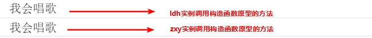
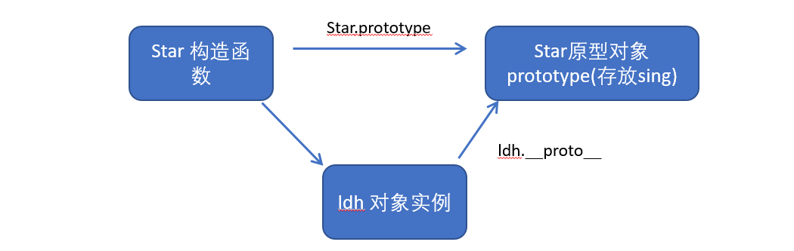
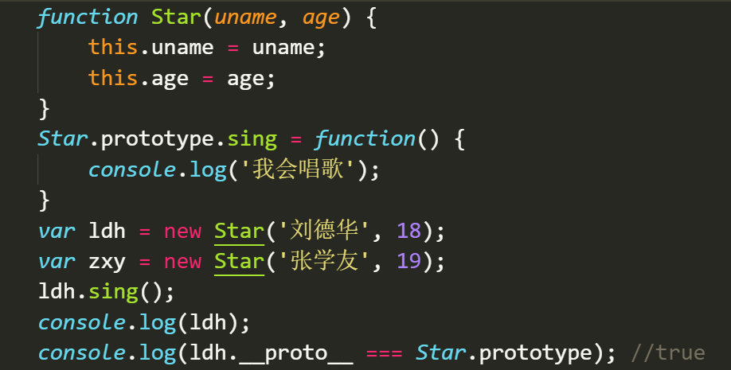
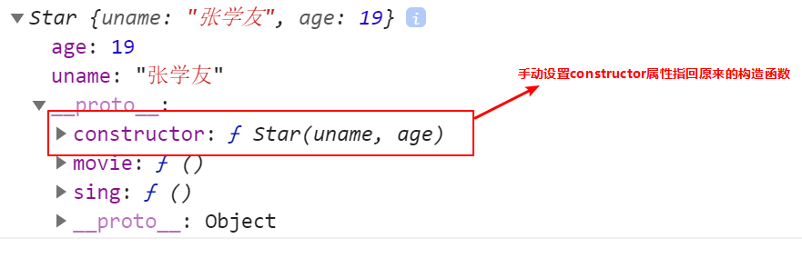
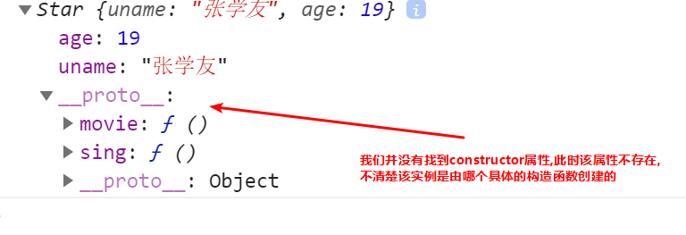
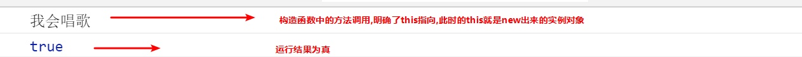
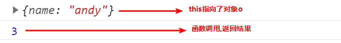
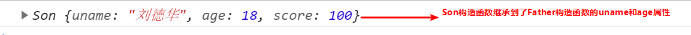
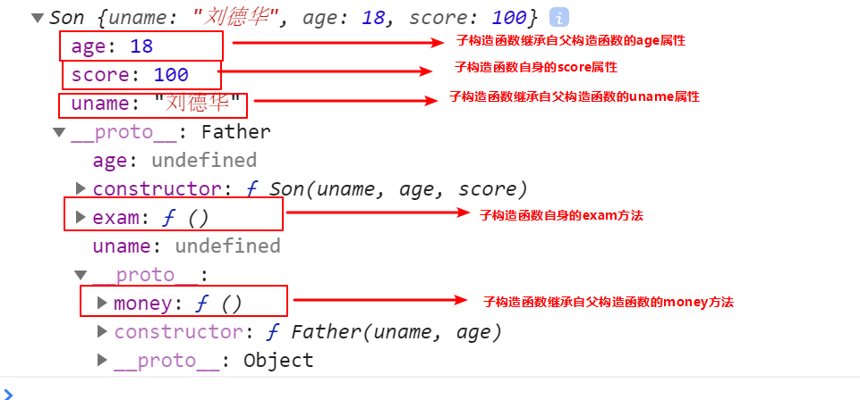

## 1.构造函数和原型

### 1.1对象的三种创建方式--复习

1. 字面量方式

```js
var obj = {};
```

2. new关键字

```js
var obj = new Object();
```

3. 构造函数方式

```js
function Person(name,age){
 this.name = name;
 this.age = age;
}
var obj = new Person('zs',12);
```

### 1.2静态成员和实例成员

#### 1.2.1实例成员

实例成员就是构造函数内部通过this添加的成员 如下列代码中uname age sing 就是实例成员,实例成员只能通过实例化的对象来访问

```js
 function Star(uname, age) {
     this.uname = uname;
     this.age = age;
     this.sing = function() {
     console.log('我会唱歌');
    }
}
var ldh = new Star('刘德华', 18);
console.log(ldh.uname);//实例成员只能通过实例化的对象来访问
```

#### 1.2.2静态成员

静态成员 在构造函数本身上添加的成员  如下列代码中 sex 就是静态成员,静态成员只能通过构造函数来访问

```js
 function Star(uname, age) {
     this.uname = uname;
     this.age = age;
     this.sing = function() {
     console.log('我会唱歌');
    }
}
Star.sex = '男';
var ldh = new Star('刘德华', 18);
console.log(Star.sex);//静态成员只能通过构造函数来访问
```

### 1.3构造函数的问题

构造函数方法很好用，但是存在浪费内存的问题。


### 1.4构造函数原型prototype

构造函数通过原型分配的函数是所有对象所共享的。

JavaScript 规定，每一个构造函数都有一个prototype 属性，指向另一个对象。注意这个prototype就是一个对象，这个对象的所有属性和方法，都会被构造函数所拥有。

我们可以把那些不变的方法，直接定义在 prototype 对象上，这样所有对象的实例就可以共享这些方法。

```js
function Star(uname, age) {
    this.uname = uname;
    this.age = age;
}
Star.prototype.sing = function() {
	console.log('我会唱歌');
}
var ldh = new Star('刘德华', 18);
var zxy = new Star('张学友', 19);
ldh.sing();//我会唱歌
zxy.sing();//我会唱歌
```



### 1.5对象原型

```html
对象都会有一个属性 __proto__ 指向构造函数的 prototype 原型对象，之所以我们对象可以使用构造函数 prototype 原型对象的属性和方法，就是因为对象有 __proto__ 原型的存在。
__proto__对象原型和原型对象 prototype 是等价的
__proto__对象原型的意义就在于为对象的查找机制提供一个方向，或者说一条路线，但是它是一个非标准属性，因此实际开发中，不可以使用这个属性，它只是内部指向原型对象 prototype
```





### 1.6constructor构造函数

```html
对象原型（ __proto__）和构造函数（prototype）原型对象里面都有一个属性 constructor 属性 ，constructor 我们称为构造函数，因为它指回构造函数本身。
constructor 主要用于记录该对象引用于哪个构造函数，它可以让原型对象重新指向原来的构造函数。
一般情况下，对象的方法都在构造函数的原型对象中设置。如果有多个对象的方法，我们可以给原型对象采取对象形式赋值，但是这样就会覆盖构造函数原型对象原来的内容，这样修改后的原型对象 constructor  就不再指向当前构造函数了。此时，我们可以在修改后的原型对象中，添加一个 constructor 指向原来的构造函数。
```

如果我们修改了原来的原型对象,给原型对象赋值的是一个对象,则必须手动的利用constructor指回原来的构造函数如:

```js
 function Star(uname, age) {
     this.uname = uname;
     this.age = age;
 }
 // 很多情况下,我们需要手动的利用constructor 这个属性指回 原来的构造函数
 Star.prototype = {
 // 如果我们修改了原来的原型对象,给原型对象赋值的是一个对象,则必须手动的利用constructor指回原来的构造函数
   constructor: Star, // 手动设置指回原来的构造函数
   sing: function() {
     console.log('我会唱歌');
   },
   movie: function() {
     console.log('我会演电影');
   }
}
var zxy = new Star('张学友', 19);
console.log(zxy)
```

以上代码运行结果,设置constructor属性如图:

如果未设置constructor属性,如图:



### 1.7原型链

​	每一个实例对象又有一个__proto__属性，指向的构造函数的原型对象，构造函数的原型对象也是一个对象，也有__proto__属性，这样一层一层往上找就形成了原型链。


### 1.8构造函数实例和原型对象三角关系

```html
1.构造函数的prototype属性指向了构造函数原型对象

2.实例对象是由构造函数创建的,实例对象的__proto__属性指向了构造函数的原型对象

3.构造函数的原型对象的constructor属性指向了构造函数,实例对象的原型的constructor属性也指向了构造函数
```


### 1.9原型链和成员的查找机制

任何对象都有原型对象,也就是prototype属性,任何原型对象也是一个对象,该对象就有__proto__属性,这样一层一层往上找,就形成了一条链,我们称此为原型链;

```html
当访问一个对象的属性（包括方法）时，首先查找这个对象自身有没有该属性。
如果没有就查找它的原型（也就是 __proto__指向的 prototype 原型对象）。
如果还没有就查找原型对象的原型（Object的原型对象）。
依此类推一直找到 Object 为止（null）。
__proto__对象原型的意义就在于为对象成员查找机制提供一个方向，或者说一条路线。
```

### 1.10原型对象中this指向

构造函数中的this和原型对象的this,都指向我们new出来的实例对象

```js
function Star(uname, age) {
    this.uname = uname;
    this.age = age;
}
var that;
Star.prototype.sing = function() {
    console.log('我会唱歌');
    that = this;
}
var ldh = new Star('刘德华', 18);
// 1. 在构造函数中,里面this指向的是对象实例 ldh
console.log(that === ldh);//true
// 2.原型对象函数里面的this 指向的是 实例对象 ldh
```



### 1.11通过原型为数组扩展内置方法

```js
 Array.prototype.sum = function() {
   var sum = 0;
   for (var i = 0; i < this.length; i++) {
   sum += this[i];
   }
   return sum;
 };
 //此时数组对象中已经存在sum()方法了  可以始终 数组.sum()进行数据的求
```

## 2.继承

### 2.1call()

- call()可以调用函数
- call()可以修改this的指向,使用call()的时候 参数一是修改后的this指向,参数2,参数3..使用逗号隔开连接

```js
 function fn(x, y) {
     console.log(this);
     console.log(x + y);
}
  var o = {
  	name: 'andy'
  };
  fn.call(o, 1, 2);//调用了函数此时的this指向了对象o,
```



### 2.2子构造函数继承父构造函数中的属性

1. 先定义一个父构造函数
2. 再定义一个子构造函数
3. 子构造函数继承父构造函数的属性(使用call方法)

```html
 // 1. 父构造函数
 function Father(uname, age) {
   // this 指向父构造函数的对象实例
   this.uname = uname;
   this.age = age;
 }
  // 2 .子构造函数 
function Son(uname, age, score) {
  // this 指向子构造函数的对象实例
  3.使用call方式实现子继承父的属性
  Father.call(this, uname, age);
  this.score = score;
}
var son = new Son('刘德华', 18, 100);
console.log(son);
```



### 2.3借用原型对象继承方法

1. 先定义一个父构造函数

2. 再定义一个子构造函数

3. 子构造函数继承父构造函数的属性(使用call方法)

```js
// 1. 父构造函数
function Father(uname, age) {
  // this 指向父构造函数的对象实例
  this.uname = uname;
  this.age = age;
}
Father.prototype.money = function() {
  console.log(100000);
 };
 // 2 .子构造函数 
  function Son(uname, age, score) {
      // this 指向子构造函数的对象实例
      Father.call(this, uname, age);
      this.score = score;
  }
// Son.prototype = Father.prototype;  这样直接赋值会有问题,如果修改了子原型对象,父原型对象也会跟着一起变化
  Son.prototype = new Father();
  // 如果利用对象的形式修改了原型对象,别忘了利用constructor 指回原来的构造函数
  Son.prototype.constructor = Son;
  // 这个是子构造函数专门的方法
  Son.prototype.exam = function() {
    console.log('孩子要考试');

  }
  var son = new Son('刘德华', 18, 100);
  console.log(son);
```

如上代码结果如图:



## 3.ES5新增方法

### 3.1数组方法forEach遍历数组

```js
 arr.forEach(function(value, index, array) {
       //参数一是:数组元素
       //参数二是:数组元素的索引
       //参数三是:当前的数组
 })
  //相当于数组遍历的 for循环 没有返回值
```

### 3.2数组方法filter过滤数组

```js
  var arr = [12, 66, 4, 88, 3, 7];
  var newArr = arr.filter(function(value, index,array) {
  	 //参数一是:数组元素
     //参数二是:数组元素的索引
     //参数三是:当前的数组
     return value >= 20;
  });
  console.log(newArr);//[66,88] //返回值是一个新数组
```

### 3.3数组方法some

```js
// 查找数组中是否有满足条件的元素 
 var arr = [10, 30, 4];
 var flag = arr.some(function(value,index,array) {
    //参数一是:数组元素
     //参数二是:数组元素的索引
     //参数三是:当前的数组
     return value < 3;
  });
console.log(flag);//false返回值是布尔值,只要查找到满足条件的一个元素就立马终止循环
```

### 3.4筛选商品案例

1. 定义数组对象数据

```js
var data = [{
           id: 1,
           pname: '小米',
           price: 3999
       }, {
           id: 2,
           pname: 'oppo',
           price: 999
       }, {
           id: 3,
           pname: '荣耀',
           price: 1299
       }, {
           id: 4,
           pname: '华为',
           price: 1999
       }, ];
```

2. 使用forEach遍历数据并渲染到页面中

```js
data.forEach(function(value) {
 var tr = document.createElement('tr');
 tr.innerHTML = '<td>' + value.id + '</td><td>' + value.pname + '</td><td>' + value.price + '</td>';
 tbody.appendChild(tr);
});
```

3. 根据价格筛选数据

   1. 获取到搜索按钮并为其绑定点击事件

      ```js
      search_price.addEventListener('click', function() {
      });
      ```

   2. 使用filter将用户输入的价格信息筛选出来

      ```js
      search_price.addEventListener('click', function() {
            var newDate = data.filter(function(value) {
              //start.value是开始区间
              //end.value是结束的区间
            	return value.price >= start.value && value.price <= end.value;
            });
            console.log(newDate);
       });
      ```

   3. 将筛选出来的数据重新渲染到表格中

      1. 将渲染数据的逻辑封装到一个函数中

         ```js
         function setDate(mydata) {
               // 先清空原来tbody 里面的数据
           tbody.innerHTML = '';
           mydata.forEach(function(value) {
             var tr = document.createElement('tr');
             tr.innerHTML = '<td>' + value.id + '</td><td>' + value.pname + '</td><td>' + value.price + '</td>';
               tbody.appendChild(tr);
           });
          }
         ```

      2. 将筛选之后的数据重新渲染

         ```js
          search_price.addEventListener('click', function() {
              var newDate = data.filter(function(value) {
              return value.price >= start.value && value.price <= end.value;
              });
              console.log(newDate);
              // 把筛选完之后的对象渲染到页面中
              setDate(newDate);
         });
         ```

4. 根据商品名称筛选

      1. 获取用户输入的商品名称

      2. 为查询按钮绑定点击事件,将输入的商品名称与这个数据进行筛选

         ```js
          search_pro.addEventListener('click', function() {
              var arr = [];
              data.some(function(value) {
                if (value.pname === product.value) {
                  // console.log(value);
                  arr.push(value);
                  return true; // return 后面必须写true  
                }
              });
              // 把拿到的数据渲染到页面中
              setDate(arr);
         })
         ```

### 3.5some和forEach区别

- 如果查询数组中唯一的元素, 用some方法更合适,在some 里面 遇到 return true 就是终止遍历 迭代效率更高
- 在forEach 里面 return 不会终止迭代

### 3.6trim方法去除字符串两端的空格

```html
var str = '   hello   '
console.log(str.trim()）  //hello 去除两端空格
var str1 = '   he l l o   '
console.log(str.trim()）  //he l l o  去除两端空格
```

### 3.7获取对象的属性名

Object.keys(对象) 获取到当前对象中的属性名 ，返回值是一个数组

```html
 var obj = {
     id: 1,
     pname: '小米',
     price: 1999,
     num: 2000
};
var result = Object.keys(obj)
console.log(result)//[id，pname,price,num]
```

### 3.8Object.defineProperty

Object.defineProperty设置或修改对象中的属性

```html
Object.defineProperty(对象，修改或新增的属性名，{
		value:修改或新增的属性的值,
		writable:true/false,//如果值为false 不允许修改这个属性值
		enumerable: false,//enumerable 如果值为false 则不允许遍历
        configurable: false  //configurable 如果为false 则不允许删除这个属性 属性是否可以被删除或是否可以再次修改特性
})	
```


