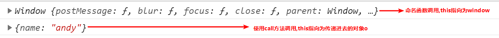
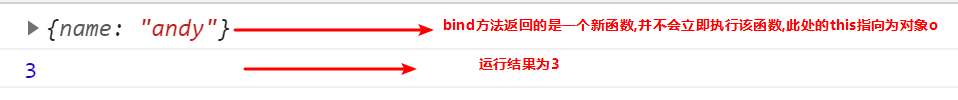
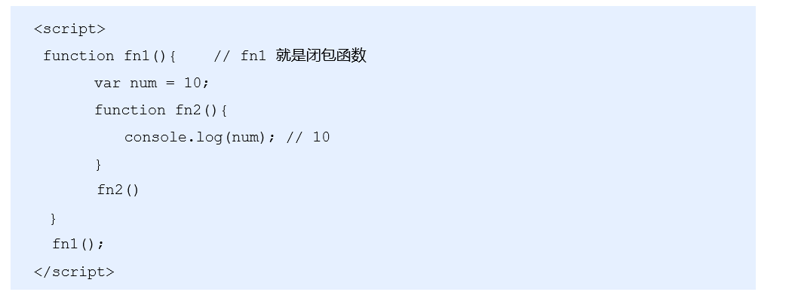
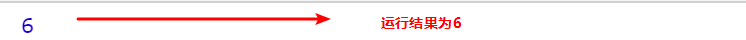

## 1.函数的定义和调用

### 1.1函数的定义方式

1. 方式1 函数声明方式 function 关键字 (命名函数)

```js
function fn(){}
```

2. 方式2 函数表达式(匿名函数)

```js
var fn = function(){}
```

3. 方式3 new Function() 

```html
var f = new Function('a', 'b', 'console.log(a + b)');
f(1, 2);

var fn = new Function('参数1','参数2'..., '函数体')
注意
/*Function 里面参数都必须是字符串格式
第三种方式执行效率低，也不方便书写，因此较少使用
所有函数都是 Function 的实例(对象)  
函数也属于对象
*/
```

### 1.2函数的调用

```js
/* 1. 普通函数 */
function fn() {
	console.log('人生的巅峰');
}
 fn(); 
/* 2. 对象的方法 */
var o = {
  sayHi: function() {
  	console.log('人生的巅峰');
  }
}
o.sayHi();
/* 3. 构造函数*/
function Star() {};
new Star();
/* 4. 绑定事件函数*/
 btn.onclick = function() {};   // 点击了按钮就可以调用这个函数
/* 5. 定时器函数*/
setInterval(function() {}, 1000);  这个函数是定时器自动1秒钟调用一次
/* 6. 立即执行函数(自调用函数)*/
(function() {
	console.log('人生的巅峰');
})();
```

## 2.this

### 2.1函数内部的this指向

这些 this 的指向，是当我们调用函数的时候确定的。调用方式的不同决定了this 的指向不同

一般指向我们的调用者.


### 2.2改变函数内部 this 指向

#### 2.2.1 call方法

call()方法调用一个对象。简单理解为调用函数的方式，但是它可以改变函数的 this 指向

应用场景:  经常做继承. 

```js
var o = {
	name: 'andy'
}
 function fn(a, b) {
      console.log(this);
      console.log(a+b)
};
fn(1,2)// 此时的this指向的是window 运行结果为3
fn.call(o,1,2)//此时的this指向的是对象o,参数使用逗号隔开,运行结果为3
```

以上代码运行结果为:



#### 2.2.2 apply方法

apply() 方法调用一个函数。简单理解为调用函数的方式，但是它可以改变函数的 this 指向。

应用场景:  经常跟数组有关系

```js
var o = {
	name: 'andy'
}
 function fn(a, b) {
      console.log(this);
      console.log(a+b)
};
fn()// 此时的this指向的是window 运行结果为3
fn.apply(o,[1,2])//此时的this指向的是对象o,参数使用数组传递 运行结果为3
```


#### 2.2.3 bind方法

bind() 方法不会调用函数,但是能改变函数内部this 指向,返回的是原函数改变this之后产生的新函数

如果只是想改变 this 指向，并且不想调用这个函数的时候，可以使用bind

应用场景:不调用函数,但是还想改变this指向

```js
 var o = {
 name: 'andy'
 };

function fn(a, b) {
	console.log(this);
	console.log(a + b);
};
var f = fn.bind(o, 1, 2); //此处的f是bind返回的新函数
f();//调用新函数  this指向的是对象o 参数使用逗号隔开
```



#### 2.2.4 call、apply、bind三者的异同

- 共同点 : 都可以改变this指向
- 不同点:
  - call 和 apply  会调用函数, 并且改变函数内部this指向.
  - call 和 apply传递的参数不一样,call传递参数使用逗号隔开,apply使用数组传递
  - bind  不会调用函数, 可以改变函数内部this指向.


- 应用场景
  1. call 经常做继承. 
  2. apply经常跟数组有关系.  比如借助于数学对象实现数组最大值最小值
  3. bind  不调用函数,但是还想改变this指向. 比如改变定时器内部的this指向. 

## 3.严格模式

### 3.1什么是严格模式

JavaScript 除了提供正常模式外，还提供了严格模式（strict mode）。ES5 的严格模式是采用具有限制性 JavaScript变体的一种方式，即在严格的条件下运行 JS 代码。

严格模式在 IE10 以上版本的浏览器中才会被支持，旧版本浏览器中会被忽略。

严格模式对正常的 JavaScript 语义做了一些更改： 

1.消除了 Javascript 语法的一些不合理、不严谨之处，减少了一些怪异行为。

2.消除代码运行的一些不安全之处，保证代码运行的安全。

3.提高编译器效率，增加运行速度。

4.禁用了在 ECMAScript 的未来版本中可能会定义的一些语法，为未来新版本的 Javascript 做好铺垫。比如一些保留字如：class,enum,export, extends, import, super 不能做变量名

### 3.2开启严格模式

严格模式可以应用到整个脚本或个别函数中。因此在使用时，我们可以将严格模式分为为脚本开启严格模式和为函数开启严格模式两种情况。

- 情况一 :为脚本开启严格模式

  - 有的 script 脚本是严格模式，有的 script 脚本是正常模式，这样不利于文件合并，所以可以将整个脚本文件放在一个立即执行的匿名函数之中。这样独立创建一个作用域而不影响其他script 脚本文件。

```html
(function (){
  //在当前的这个自调用函数中有开启严格模式，当前函数之外还是普通模式
　　　　"use strict";
       var num = 10;
　　　　function fn() {}
})();
//或者 
<script>
  　"use strict"; //当前script标签开启了严格模式
</script>
<script>
            //当前script标签未开启严格模式
</script>
```

- 情况二: 为函数开启严格模式

  - 要给某个函数开启严格模式，需要把“use strict”;  (或 'use strict'; ) 声明放在函数体所有语句之前。

    ```js
    function fn(){
    　　"use strict";
    　　return "123";
    } 
    //当前fn函数开启了严格模式
    ```

### 3.3严格模式中的变化

严格模式对 Javascript 的语法和行为，都做了一些改变。

```html
'use strict'
num = 10 
console.log(num)//严格模式后使用未声明的变量
--------------------------------------------------------------------------------
var num2 = 1;
delete num2;//严格模式不允许删除变量
--------------------------------------------------------------------------------
function fn() {
 console.log(this); // 严格模式下全局作用域中函数中的 this 是 undefined
}
fn();  
---------------------------------------------------------------------------------
function Star() {
	 this.sex = '男';
}
// Star();严格模式下,如果 构造函数不加new调用, this 指向的是undefined 如果给他赋值则 会报错.
var ldh = new Star();
console.log(ldh.sex);
----------------------------------------------------------------------------------
setTimeout(function() {
  console.log(this); //严格模式下，定时器 this 还是指向 window
}, 2000);  
```

[更多严格模式要求参考](https://developer.mozilla.org/zh-CN/docs/Web/JavaScript/Reference/Strict_mode)

## 4.高阶函数

高阶函数是对其他函数进行操作的函数，它接收函数作为参数或将函数作为返回值输出。

.png)

此时fn 就是一个高阶函数

函数也是一种数据类型，同样可以作为参数，传递给另外一个参数使用。最典型的就是作为回调函数。

同理函数也可以作为返回值传递回来

## 5.闭包

### 5.1变量的作用域复习

变量根据作用域的不同分为两种：全局变量和局部变量。

1. 函数内部可以使用全局变量。
2. 函数外部不可以使用局部变量。
3. 当函数执行完毕，本作用域内的局部变量会销毁。

### 5.2什么是闭包

闭包（closure）指有权访问另一个函数作用域中变量的函数。简单理解就是 ，一个作用域可以访问另外一个函数内部的局部变量。 



### 5.3闭包的作用

作用：延伸变量的作用范围。

```js
 function fn() {
   var num = 10;
   function fun() {
       console.log(num);
 	}
    return fun;
 }
var f = fn();
f();
```

### 5.4闭包的案例

1. 利用闭包的方式得到当前li 的索引号

```js
for (var i = 0; i < lis.length; i++) {
// 利用for循环创建了4个立即执行函数
// 立即执行函数也成为小闭包因为立即执行函数里面的任何一个函数都可以使用它的i这变量
(function(i) {
    lis[i].onclick = function() {
      console.log(i);
    }
 })(i);
}
```

2. 闭包应用-3秒钟之后,打印所有li元素的内容

```js
 for (var i = 0; i < lis.length; i++) {
   (function(i) {
     setTimeout(function() {
     console.log(lis[i].innerHTML);
     }, 3000)
   })(i);
}
```

3. 闭包应用-计算打车价格 

```js
/*需求分析
打车起步价13(3公里内),  之后每多一公里增加 5块钱.  用户输入公里数就可以计算打车价格
如果有拥堵情况,总价格多收取10块钱拥堵费*/

 var car = (function() {
     var start = 13; // 起步价  局部变量
     var total = 0; // 总价  局部变量
     return {
       // 正常的总价
       price: function(n) {
         if (n <= 3) {
           total = start;
         } else {
           total = start + (n - 3) * 5
         }
         return total;
       },
       // 拥堵之后的费用
       yd: function(flag) {
         return flag ? total + 10 : total;
       }
	}
 })();
console.log(car.price(5)); // 23
console.log(car.yd(true)); // 33
```

### 5.5案例

```js
 var name = "The Window";
   var object = {
     name: "My Object",
     getNameFunc: function() {
     return function() {
     return this.name;
     };
   }
 };
console.log(object.getNameFunc()())
var name = "The Window";　　
  var object = {　　　　
    name: "My Object",
    getNameFunc: function() {
    var that = this;
    return function() {
    return that.name;
    };
  }
};
console.log(object.getNameFunc()())
       
```

## 6.递归

### 6.1什么是递归

**递归**：如果一个函数在内部可以调用其本身，那么这个函数就是递归函数。简单理解:函数内部自己调用自己, 这个函数就是递归函数

**注意**：递归函数的作用和循环效果一样，由于递归很容易发生“栈溢出”错误（stack overflow），所以必须要加退出条件return。

### 6.2利用递归求1~n的阶乘

```js
//利用递归函数求1~n的阶乘 1 * 2 * 3 * 4 * ..n
 function fn(n) {
     if (n == 1) { //结束条件
       return 1;
     }
     return n * fn(n - 1);
 }
 console.log(fn(3));
```



### 6.3利用递归求斐波那契数列

```js
// 利用递归函数求斐波那契数列(兔子序列)  1、1、2、3、5、8、13、21...
// 用户输入一个数字 n 就可以求出 这个数字对应的兔子序列值
// 我们只需要知道用户输入的n 的前面两项(n-1 n-2)就可以计算出n 对应的序列值
function fb(n) {
  if (n === 1 || n === 2) {
        return 1;
  }
  return fb(n - 1) + fb(n - 2);
}
console.log(fb(3));
```

### 6.4利用递归遍历数据

```js
// 我们想要做输入id号,就可以返回的数据对象
 var data = [{
   id: 1,
   name: '家电',
   goods: [{
     id: 11,
     gname: '冰箱',
     goods: [{
       id: 111,
       gname: '海尔'
     }, {
       id: 112,
       gname: '美的'
     },

            ]

   }, {
     id: 12,
     gname: '洗衣机'
   }]
 }, {
   id: 2,
   name: '服饰'
}];
//1.利用 forEach 去遍历里面的每一个对象
 function getID(json, id) {
   var o = {};
   json.forEach(function(item) {
     // console.log(item); // 2个数组元素
     if (item.id == id) {
       // console.log(item);
       o = item;
       return o;
       // 2. 我们想要得里层的数据 11 12 可以利用递归函数
       // 里面应该有goods这个数组并且数组的长度不为 0 
     } else if (item.goods && item.goods.length > 0) {
       o = getID(item.goods, id);
     }
   });
   return o;
}
```

