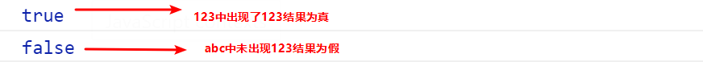
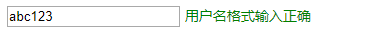
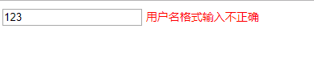

## 1.正则表达式概述

### 1.1什么是正则表达式

正则表达式（ Regular Expression ）是用于匹配字符串中字符组合的模式。在JavaScript中，正则表达式也是对象。

正则表通常被用来检索、替换那些符合某个模式（规则）的文本，例如验证表单：用户名表单只能输入英文字母、数字或者下划线， 昵称输入框中可以输入中文(匹配)。此外，正则表达式还常用于过滤掉页面内容中的一些敏感词(替换)，或从字符串中获取我们想要的特定部分(提取)等 。

其他语言也会使用正则表达式，本阶段我们主要是利用JavaScript 正则表达式完成表单验证。

### 1.2 正则表达式的特点

1. 灵活性、逻辑性和功能性非常的强。
2. 可以迅速地用极简单的方式达到字符串的复杂控制。
3. 对于刚接触的人来说，比较晦涩难懂。比如：^\w+([-+.]\w+)*@\w+([-.]\w+)*\.\w+([-.]\w+)*$
4. 实际开发,一般都是直接复制写好的正则表达式. 但是要求会使用正则表达式并且根据实际情况修改正则表达式。比如用户名: /^[a-z0-9_-]{3,16}$/

## 2.正则表达式在js中的使用

### 2.1正则表达式的创建

在 JavaScript 中，可以通过两种方式创建一个正则表达式。

方式一：通过调用RegExp对象的构造函数创建 

```js
var regexp = new RegExp(/123/);
console.log(regexp);
```

方式二：利用字面量创建 正则表达式

```js
 var rg = /123/;
```

### 2.2测试正则表达式 

test() 正则对象方法，用于检测字符串是否符合该规则，该对象会返回 true 或 false，其参数是测试字符串。

```js
var rg = /123/;
console.log(rg.test(123));//匹配字符中是否出现123  出现结果为true
console.log(rg.test('abc'));//匹配字符中是否出现123 未出现结果为false
```



## 3.正则表达式中的特殊字符

### 3.1正则表达式的组成

一个正则表达式可以由简单的字符构成，比如 /abc/，也可以是简单和特殊字符的组合，比如 /ab*c/ 。其中特殊字符也被称为元字符，在正则表达式中是具有特殊意义的专用符号，如 ^ 、$ 、+ 等。

特殊字符非常多，可以参考： 

[MDN](https://developer.mozilla.org/zh-CN/docs/Web/JavaScript/Guide/Regular_Expressions)

jQuery 手册：正则表达式部分

[正则测试工具]( <http://tool.oschina.net/regex)

### 3.2边界符

正则表达式中的边界符（位置符）用来提示字符所处的位置，主要有两个字符

| 边界符  | 说明              |
| ---- | --------------- |
| ^    | 表示匹配行首的文本（以谁开始） |
| $    | 表示匹配行尾的文本（以谁结束） |

如果 ^和 $ 在一起，表示必须是精确匹配。

```js
var rg = /abc/; // 正则表达式里面不需要加引号 不管是数字型还是字符串型
// /abc/ 只要包含有abc这个字符串返回的都是true
console.log(rg.test('abc'));
console.log(rg.test('abcd'));
console.log(rg.test('aabcd'));
console.log('---------------------------');
var reg = /^abc/;
console.log(reg.test('abc')); // true
console.log(reg.test('abcd')); // true
console.log(reg.test('aabcd')); // false
console.log('---------------------------');
var reg1 = /^abc$/; // 精确匹配 要求必须是 abc字符串才符合规范
console.log(reg1.test('abc')); // true
console.log(reg1.test('abcd')); // false
console.log(reg1.test('aabcd')); // false
console.log(reg1.test('abcabc')); // false
```

### 3.3字符类

字符类表示有一系列字符可供选择，只要匹配其中一个就可以了。所有可供选择的字符都放在方括号内。

#### 3.3.1 [] 方括号

表示有一系列字符可供选择，只要匹配其中一个就可以了

```js
var rg = /[abc]/; // 只要包含有a 或者 包含有b 或者包含有c 都返回为true
console.log(rg.test('andy'));//true
console.log(rg.test('baby'));//true
console.log(rg.test('color'));//true
console.log(rg.test('red'));//false
var rg1 = /^[abc]$/; // 三选一 只有是a 或者是 b  或者是c 这三个字母才返回 true
console.log(rg1.test('aa'));//false
console.log(rg1.test('a'));//true
console.log(rg1.test('b'));//true
console.log(rg1.test('c'));//true
console.log(rg1.test('abc'));//true
var reg = /^[a-z]$/ //26个英文字母任何一个字母返回 true  - 表示的是a 到z 的范围  
console.log(reg.test('a'));//true
console.log(reg.test('z'));//true
console.log(reg.test('A'));//false
//字符组合
var reg1 = /^[a-zA-Z0-9]$/; // 26个英文字母(大写和小写都可以)任何一个字母返回 true  
//取反 方括号内部加上 ^ 表示取反，只要包含方括号内的字符，都返回 false 。
var reg2 = /^[^a-zA-Z0-9]$/;
console.log(reg2.test('a'));//false
console.log(reg2.test('B'));//false
console.log(reg2.test(8));//false
console.log(reg2.test('!'));//true
```

#### 3.3.2量词符

量词符用来设定某个模式出现的次数。

| 量词    | 说明       |
| ----- | -------- |
| *     | 重复0次或更多次 |
| +     | 重复1次或更多次 |
| ?     | 重复0次或1次  |
| {n}   | 重复n次     |
| {n,}  | 重复n次或更多次 |
| {n,m} | 重复n到m次   |

#### 3.3.3用户名表单验证

功能需求:

1. 如果用户名输入合法, 则后面提示信息为:  用户名合法,并且颜色为绿色
2. 如果用户名输入不合法, 则后面提示信息为:  用户名不符合规范, 并且颜色为红色





分析:

1. 用户名只能为英文字母,数字,下划线或者短横线组成, 并且用户名长度为6~16位.
2. 首先准备好这种正则表达式模式/$[a-zA-Z0-9-_]{6,16}^/
3. 当表单失去焦点就开始验证. 
4. 如果符合正则规范, 则让后面的span标签添加 right类.
5. 如果不符合正则规范, 则让后面的span标签添加 wrong类.

```js
<input type="text" class="uname"> <span>请输入用户名</span>
 <script>
 //  量词是设定某个模式出现的次数
 var reg = /^[a-zA-Z0-9_-]{6,16}$/; // 这个模式用户只能输入英文字母 数字 下划线 中划线
 var uname = document.querySelector('.uname');
 var span = document.querySelector('span');
 uname.onblur = function() {
   if (reg.test(this.value)) {
   console.log('正确的');
   span.className = 'right';
   span.innerHTML = '用户名格式输入正确';
   } else {
   console.log('错误的');
   span.className = 'wrong';
   span.innerHTML = '用户名格式输入不正确';
   }
 }
</script>
```

#### 3.3.4 括号总结

1.大括号  量词符.  里面表示重复次数

2.中括号 字符集合。匹配方括号中的任意字符. 

3.小括号表示优先级

[正则表达式在线测试](https://c.runoob.com/)

### 3.4预定义类

预定义类指的是某些常见模式的简写方式.


**案例:验证座机号码**

```js
var reg = /^\d{3}-\d{8}|\d{4}-\d{7}$/;
var reg = /^\d{3,4}-\d{7,8}$/;
```

**表单验证案例**

```js
//手机号验证:/^1[3|4|5|7|8][0-9]{9}$/;
//验证通过与不通过更换元素的类名与元素中的内容
 if (reg.test(this.value)) {
    // console.log('正确的');
    this.nextElementSibling.className = 'success';
    this.nextElementSibling.innerHTML = '<i class="success_icon"></i> 恭喜您输入正确';
   } else {
       // console.log('不正确');
      this.nextElementSibling.className = 'error';
      this.nextElementSibling.innerHTML = '<i class="error_icon"></i>格式不正确,请从新输入 ';
 }
```

```js
//QQ号验证: /^[1-9]\d{4,}$/; 
//昵称验证:/^[\u4e00-\u9fa5]{2,8}$/
//验证通过与不通过更换元素的类名与元素中的内容 ,将上一步的匹配代码进行封装,多次调用即可
 function regexp(ele, reg) {
    ele.onblur = function() {
      if (reg.test(this.value)) {
        // console.log('正确的');
        this.nextElementSibling.className = 'success';
        this.nextElementSibling.innerHTML = '<i class="success_icon"></i> 恭喜您输入正确';
   } else {
     // console.log('不正确');
     this.nextElementSibling.className = 'error';
     this.nextElementSibling.innerHTML = '<i class="error_icon"></i> 格式不正确,请从新输入 ';
            }
        }
 };
```

```js
//密码验证:/^[a-zA-Z0-9_-]{6,16}$/
//再次输入密码只需匹配与上次输入的密码值 是否一致
```

### 3.5正则替换replace

replace() 方法可以实现替换字符串操作，用来替换的参数可以是一个字符串或是一个正则表达式。

```js
var str = 'andy和red';
var newStr = str.replace('andy', 'baby');
console.log(newStr)//baby和red
//等同于 此处的andy可以写在正则表达式内
var newStr2 = str.replace(/andy/, 'baby');
console.log(newStr2)//baby和red
//全部替换
var str = 'abcabc'
var nStr = str.replace(/a/,'哈哈')
console.log(nStr) //哈哈bcabc
//全部替换g
var nStr = str.replace(/a/a,'哈哈')
console.log(nStr) //哈哈bc哈哈bc
//忽略大小写i
var str = 'aAbcAba';
var newStr = str.replace(/a/gi,'哈哈')//"哈哈哈哈bc哈哈b哈哈"
```

**案例:过滤敏感词汇**

```js
<textarea name="" id="message"></textarea> <button>提交</button>
<div></div>
<script>
    var text = document.querySelector('textarea');
    var btn = document.querySelector('button');
    var div = document.querySelector('div');
    btn.onclick = function() {
    	div.innerHTML = text.value.replace(/激情|gay/g, '**');
    }
</script>
```

