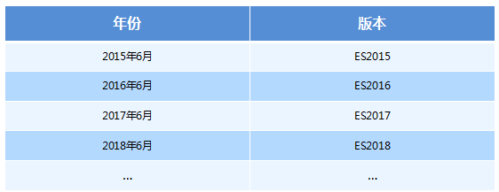
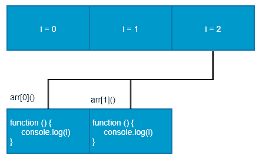
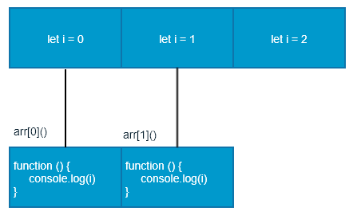
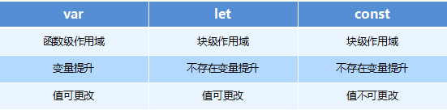

# ES6语法

## 目标

- 能够说出使用let关键字声明变量的特点
- 能够使用解构赋值从数组中提取值
- 能够说出箭头函数拥有的特性
- 能够使用剩余参数接收剩余的函数参数
- 能够使用拓展运算符拆分数组
- 能够说出模板字符串拥有的特性

## ES6相关概念（★★）

### 什么是ES6

ES 的全称是 ECMAScript , 它是由 ECMA 国际标准化组织,制定的一项脚本语言的标准化规范。



### 为什么使用 ES6 ?

每一次标准的诞生都意味着语言的完善，功能的加强。JavaScript语言本身也有一些令人不满意的地方。

- 变量提升特性增加了程序运行时的不可预测性
- 语法过于松散，实现相同的功能，不同的人可能会写出不同的代码

## ES6新增语法

### let（★★★）

ES6中新增了用于声明变量的关键字

#### let声明的变量只在所处于的块级有效

```javascript
 if (true) { 
     let a = 10;
 }
console.log(a) // a is not defined
```

**注意：**使用let关键字声明的变量才具有块级作用域，使用var声明的变量不具备块级作用域特性。

#### 不存在变量提升

```javascript
console.log(a); // a is not defined 
let a = 20;
```

#### 暂时性死区

利用let声明的变量会绑定在这个块级作用域，不会受外界的影响

```javascript
 var tmp = 123;
 if (true) { 
     tmp = 'abc';
     let tmp; 
 } 
```

#### 经典面试题

```javascript
 var arr = [];
 for (var i = 0; i < 2; i++) {
     arr[i] = function () {
         console.log(i); 
     }
 }
 arr[0]();
 arr[1]();

```



**经典面试题图解：**此题的关键点在于变量i是全局的，函数执行时输出的都是全局作用域下的i值。

```javascript
 let arr = [];
 for (let i = 0; i < 2; i++) {
     arr[i] = function () {
         console.log(i); 
     }
 }
 arr[0]();
 arr[1]();

```



**经典面试题图解：**此题的关键点在于每次循环都会产生一个块级作用域，每个块级作用域中的变量都是不同的，函数执行时输出的是自己上一级（循环产生的块级作用域）作用域下的i值.

#### 小结

- let关键字就是用来声明变量的
- 使用let关键字声明的变量具有块级作用域
- 在一个大括号中 使用let关键字声明的变量才具有块级作用域 var关键字是不具备这个特点的
- 防止循环变量变成全局变量
- 使用let关键字声明的变量没有变量提升
- 使用let关键字声明的变量具有暂时性死区特性

### const（★★★）

声明常量，常量就是值（内存地址）不能变化的量

#### 具有块级作用域

```javascript
 if (true) { 
     const a = 10;
 }
console.log(a) // a is not defined
```

#### 声明常量时必须赋值

```javascript
const PI; // Missing initializer in const declaration
```

#### 常量赋值后，值不能修改

```javascript
const PI = 3.14;
PI = 100; // Assignment to constant variable.

const ary = [100, 200];
ary[0] = 'a';
ary[1] = 'b';
console.log(ary); // ['a', 'b']; 
ary = ['a', 'b']; // Assignment to constant variable.
```

#### 小结

- const声明的变量是一个常量
- 既然是常量不能重新进行赋值，如果是基本数据类型，不能更改值，如果是复杂数据类型，不能更改地址值
- 声明 const时候必须要给定值

### let、const、var 的区别

- 使用 var 声明的变量，其作用域为该语句所在的函数内，且存在变量提升现象
- 使用 let 声明的变量，其作用域为该语句所在的代码块内，不存在变量提升
- 使用 const 声明的是常量，在后面出现的代码中不能再修改该常量的值



### 解构赋值（★★★）

ES6中允许从数组中提取值，按照对应位置，对变量赋值，对象也可以实现解构

#### 数组解构

```javascript
 let [a, b, c] = [1, 2, 3];
 console.log(a)//1
 console.log(b)//2
 console.log(c)//3
//如果解构不成功，变量的值为undefined
```

#### 对象解构

```javascript
 let person = { name: 'zhangsan', age: 20 }; 
 let { name, age } = person;
 console.log(name); // 'zhangsan' 
 console.log(age); // 20

 let {name: myName, age: myAge} = person; // myName myAge 属于别名
 console.log(myName); // 'zhangsan' 
 console.log(myAge); // 20

```

#### 小结

- 解构赋值就是把数据结构分解，然后给变量进行赋值
- 如果结构不成功，变量跟数值个数不匹配的时候，变量的值为undefined
- 数组解构用中括号包裹，多个变量用逗号隔开，对象解构用花括号包裹，多个变量用逗号隔开
- 利用解构赋值能够让我们方便的去取对象中的属性跟方法

### 箭头函数（★★★）

ES6中新增的定义函数的方式。

```javascript
() => {} //()：代表是函数； =>：必须要的符号，指向哪一个代码块；{}：函数体
const fn = () => {}//代表把一个函数赋值给fn
```

函数体中只有一句代码，且代码的执行结果就是返回值，可以省略大括号

```javascript
 function sum(num1, num2) { 
     return num1 + num2; 
 }
 //es6写法
 const sum = (num1, num2) => num1 + num2; 

```

如果形参只有一个，可以省略小括号

```javascript
 function fn (v) {
     return v;
 } 
//es6写法
 const fn = v => v;

```

箭头函数不绑定this关键字，箭头函数中的this，指向的是函数定义位置的上下文this

```javascript
const obj = { name: '张三'} 
 function fn () { 
     console.log(this);//this 指向 是obj对象
     return () => { 
         console.log(this);//this 指向 的是箭头函数定义的位置，那么这个箭头函数定义在fn里面，而这个fn指向是的obj对象，所以这个this也指向是obj对象
     } 
 } 
 const resFn = fn.call(obj); 
 resFn();

```

#### 小结

- 箭头函数中不绑定this，箭头函数中的this指向是它所定义的位置，可以简单理解成，定义箭头函数中的作用域的this指向谁，它就指向谁
- 箭头函数的优点在于解决了this执行环境所造成的一些问题。比如：解决了匿名函数this指向的问题（匿名函数的执行环境具有全局性），包括setTimeout和setInterval中使用this所造成的问题

#### 面试题

```javascript
var age = 100;

var obj = {
	age: 20,
	say: () => {
		alert(this.age)
	}
}

obj.say();//箭头函数this指向的是被声明的作用域里面，而对象没有作用域的，所以箭头函数虽然在对象中被定义，但是this指向的是全局作用域
```

### 剩余参数（★★）

剩余参数语法允许我们将一个不定数量的参数表示为一个数组，不定参数定义方式，这种方式很方便的去声明不知道参数情况下的一个函数

```javascript
function sum (first, ...args) {
     console.log(first); // 10
     console.log(args); // [20, 30] 
 }
 sum(10, 20, 30)

```

#### 剩余参数和解构配合使用

```javascript
let students = ['wangwu', 'zhangsan', 'lisi'];
let [s1, ...s2] = students; 
console.log(s1);  // 'wangwu' 
console.log(s2);  // ['zhangsan', 'lisi']

```

## ES6 的内置对象扩展

### Array 的扩展方法（★★）

#### 扩展运算符（展开语法）

扩展运算符可以将数组或者对象转为用逗号分隔的参数序列

```javascript
 let ary = [1, 2, 3];
 ...ary  // 1, 2, 3
 console.log(...ary);    // 1 2 3,相当于下面的代码
 console.log(1,2,3);
```

##### 扩展运算符可以应用于合并数组

```javascript
// 方法一 
 let ary1 = [1, 2, 3];
 let ary2 = [3, 4, 5];
 let ary3 = [...ary1, ...ary2];
 // 方法二 
 ary1.push(...ary2);
```

##### 将类数组或可遍历对象转换为真正的数组

```javascript
let oDivs = document.getElementsByTagName('div'); 
oDivs = [...oDivs];
```

#### 构造函数方法：Array.from()

将伪数组或可遍历对象转换为真正的数组

```javascript
//定义一个集合
let arrayLike = {
    '0': 'a',
    '1': 'b',
    '2': 'c',
    length: 3
}; 
//转成数组
let arr2 = Array.from(arrayLike); // ['a', 'b', 'c']
```

方法还可以接受第二个参数，作用类似于数组的map方法，用来对每个元素进行处理，将处理后的值放入返回的数组

```javascript
 let arrayLike = { 
     "0": 1,
     "1": 2,
     "length": 2
 }
 let newAry = Array.from(arrayLike, item => item *2)//[2,4]

```

注意：如果是对象，那么属性需要写对应的索引

#### 实例方法：find()

用于找出第一个符合条件的数组成员，如果没有找到返回undefined

```javascript
let ary = [{
     id: 1,
     name: '张三'
 }, { 
     id: 2,
     name: '李四'
 }]; 
 let target = ary.find((item, index) => item.id == 2);//找数组里面符合条件的值，当数组中元素id等于2的查找出来，注意，只会匹配第一个

```

#### 实例方法：findIndex()

用于找出第一个符合条件的数组成员的位置，如果没有找到返回-1

```javascript
let ary = [1, 5, 10, 15];
let index = ary.findIndex((value, index) => value > 9); 
console.log(index); // 2
```

#### 实例方法：includes()

判断某个数组是否包含给定的值，返回布尔值。

```javascript
[1, 2, 3].includes(2) // true 
[1, 2, 3].includes(4) // false

```

### String 的扩展方法

#### 模板字符串（★★★）

ES6新增的创建字符串的方式，使用反引号定义

```javascript
let name = `zhangsan`;

```

##### 模板字符串中可以解析变量

```javascript
let name = '张三'; 
let sayHello = `hello,my name is ${name}`; // hello, my name is zhangsan
```

##### 模板字符串中可以换行

```javascript
 let result = { 
     name: 'zhangsan', 
     age: 20,
     sex: '男' 
 } 
 let html = ` <div>
     <span>${result.name}</span>
     <span>${result.age}</span>
     <span>${result.sex}</span>
 </div> `;

```

##### 在模板字符串中可以调用函数

```javascript
const sayHello = function () { 
    return '哈哈哈哈 追不到我吧 我就是这么强大';
 }; 
 let greet = `${sayHello()} 哈哈哈哈`;
 console.log(greet); // 哈哈哈哈 追不到我吧 我就是这么强大 哈哈哈哈

```

#### 实例方法：startsWith() 和 endsWith()

- startsWith()：表示参数字符串是否在原字符串的头部，返回布尔值
- endsWith()：表示参数字符串是否在原字符串的尾部，返回布尔值

```javascript
let str = 'Hello world!';
str.startsWith('Hello') // true 
str.endsWith('!')       // true

```

#### 实例方法：repeat()

repeat方法表示将原字符串重复n次，返回一个新字符串

```javascript
'x'.repeat(3)      // "xxx" 
'hello'.repeat(2)  // "hellohello"
```

### Set 数据结构（★★）

ES6 提供了新的数据结构  Set。它类似于数组，但是成员的值都是唯一的，没有重复的值。

Set本身是一个构造函数，用来生成  Set  数据结构

```javascript
const s = new Set();
```

Set函数可以接受一个数组作为参数，用来初始化。

```javascript
const set = new Set([1, 2, 3, 4, 4]);//{1, 2, 3, 4}

```

#### 实例方法

- add(value)：添加某个值，返回 Set 结构本身
- delete(value)：删除某个值，返回一个布尔值，表示删除是否成功
- has(value)：返回一个布尔值，表示该值是否为 Set 的成员
- clear()：清除所有成员，没有返回值

```javascript
 const s = new Set();
 s.add(1).add(2).add(3); // 向 set 结构中添加值 
 s.delete(2)             // 删除 set 结构中的2值   
 s.has(1)                // 表示 set 结构中是否有1这个值 返回布尔值 
 s.clear()               // 清除 set 结构中的所有值
 //注意：删除的是元素的值，不是代表的索引
```

#### 遍历

Set 结构的实例与数组一样，也拥有forEach方法，用于对每个成员执行某种操作，没有返回值。

```javascript
s.forEach(value => console.log(value))

```

