## 1.1. 节点操作

### 1.1.1 删除节点

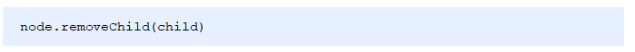

node.removeChild() 方法从 node节点中删除一个子节点，返回删除的节点。

```html
    <button>删除</button>
    <ul>
        <li>熊大</li>
        <li>熊二</li>
        <li>光头强</li>
    </ul>
    <script>
        // 1.获取元素
        var ul = document.querySelector('ul');
        var btn = document.querySelector('button');
        // 2. 删除元素  node.removeChild(child)
        // ul.removeChild(ul.children[0]);
        // 3. 点击按钮依次删除里面的孩子
        btn.onclick = function() {
            if (ul.children.length == 0) {
                this.disabled = true;
            } else {
                ul.removeChild(ul.children[0]);
            }
        }
    </script>
```


### 1.1.2 案例：删除留言

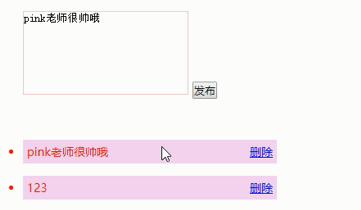

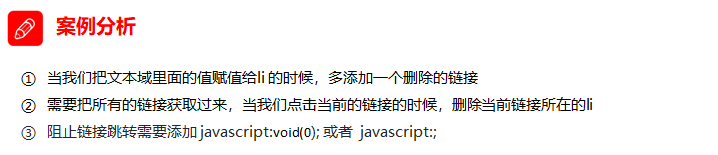

```html
    <textarea name="" id=""></textarea>
    <button>发布</button>
    <ul>

    </ul>
    <script>
        // 1. 获取元素
        var btn = document.querySelector('button');
        var text = document.querySelector('textarea');
        var ul = document.querySelector('ul');
        // 2. 注册事件
        btn.onclick = function() {
            if (text.value == '') {
                alert('您没有输入内容');
                return false;
            } else {
                // console.log(text.value);
                // (1) 创建元素
                var li = document.createElement('li');
                // 先有li 才能赋值
                li.innerHTML = text.value + "<a href='javascript:;'>删除</a>";
                // (2) 添加元素
                // ul.appendChild(li);
                ul.insertBefore(li, ul.children[0]);
                // (3) 删除元素 删除的是当前链接的li  它的父亲
                var as = document.querySelectorAll('a');
                for (var i = 0; i < as.length; i++) {
                    as[i].onclick = function() {
                        // 删除的是 li 当前a所在的li  this.parentNode;
                        ul.removeChild(this.parentNode);
                    }
                }
            }
        }
    </script>
```

### 1.1.3 复制（克隆）节点

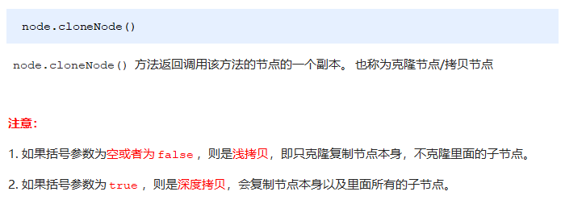

```html
    <ul>
        <li>1111</li>
        <li>2</li>
        <li>3</li>
    </ul>
    <script>
        var ul = document.querySelector('ul');
        // 1. node.cloneNode(); 括号为空或者里面是false 浅拷贝 只复制标签不复制里面的内容
        // 2. node.cloneNode(true); 括号为true 深拷贝 复制标签复制里面的内容
        var lili = ul.children[0].cloneNode(true);
        ul.appendChild(lili);
    </script>
```

### 1.1.4 案例：动态生成表格

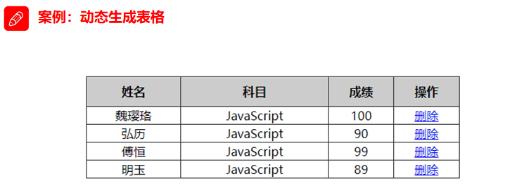

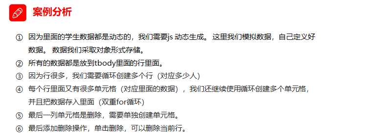

```html
    <script>
        // 1.先去准备好学生的数据
        var datas = [{
            name: '魏璎珞',
            subject: 'JavaScript',
            score: 100
        }, {
            name: '弘历',
            subject: 'JavaScript',
            score: 98
        }, {
            name: '傅恒',
            subject: 'JavaScript',
            score: 99
        }, {
            name: '明玉',
            subject: 'JavaScript',
            score: 88
        }, {
            name: '大猪蹄子',
            subject: 'JavaScript',
            score: 0
        }];
        // 2. 往tbody 里面创建行： 有几个人（通过数组的长度）我们就创建几行
        var tbody = document.querySelector('tbody');
		// 遍历数组
        for (var i = 0; i < datas.length; i++) { 
            // 1. 创建 tr行
            var tr = document.createElement('tr');
            tbody.appendChild(tr);
            // 2. 行里面创建单元格td 单元格的数量取决于每个对象里面的属性个数  
            // 使用for in遍历学生对象
            for (var k in datas[i]) { 
                // 创建单元格 
                var td = document.createElement('td');
                // 把对象里面的属性值 datas[i][k] 给 td  
                td.innerHTML = datas[i][k];
                tr.appendChild(td);
            }
            // 3. 创建有删除2个字的单元格 
            var td = document.createElement('td');
            td.innerHTML = '<a href="javascript:;">删除 </a>';
            tr.appendChild(td);

        }
        // 4. 删除操作 开始 
        var as = document.querySelectorAll('a');
        for (var i = 0; i < as.length; i++) {
            as[i].onclick = function() {
                // 点击a 删除 当前a 所在的行(链接的爸爸的爸爸)  node.removeChild(child)  
                tbody.removeChild(this.parentNode.parentNode)
            }
        }
    </script>
```


### 1.1.5 创建元素的三种方式


```html
    <script>
        // 三种创建元素方式区别 
        // 1. document.write() 创建元素  如果页面文档流加载完毕，再调用这句话会导致页面重绘
         var btn = document.querySelector('button');
         btn.onclick = function() {
             document.write('<div>123</div>');
         }

        // 2. innerHTML 创建元素
        var inner = document.querySelector('.inner');
         for (var i = 0; i <= 100; i++) {
             inner.innerHTML += '<a href="#">百度</a>'
         }
        var arr = [];
        for (var i = 0; i <= 100; i++) {
            arr.push('<a href="#">百度</a>');
        }
        inner.innerHTML = arr.join('');
        // 3. document.createElement() 创建元素
        var create = document.querySelector('.create');
        for (var i = 0; i <= 100; i++) {
            var a = document.createElement('a');
            create.appendChild(a);
        }
    </script>
```


### 1.1.6 innerTHML和createElement效率对比

**innerHTML字符串拼接方式（效率低）**

```html
<script>
    function fn() {
        var d1 = +new Date();
        var str = '';
        for (var i = 0; i < 1000; i++) {
            document.body.innerHTML += '<div style="width:100px; height:2px; border:1px solid blue;"></div>';
        }
        var d2 = +new Date();
        console.log(d2 - d1);
    }
    fn();
</script>
```

**createElement方式（效率一般）**

```html
<script>
    function fn() {
        var d1 = +new Date();

        for (var i = 0; i < 1000; i++) {
            var div = document.createElement('div');
            div.style.width = '100px';
            div.style.height = '2px';
            div.style.border = '1px solid red';
            document.body.appendChild(div);
        }
        var d2 = +new Date();
        console.log(d2 - d1);
    }
    fn();
</script>
```

**innerHTML数组方式（效率高）**

```html
<script>
    function fn() {
        var d1 = +new Date();
        var array = [];
        for (var i = 0; i < 1000; i++) {
            array.push('<div style="width:100px; height:2px; border:1px solid blue;"></div>');
        }
        document.body.innerHTML = array.join('');
        var d2 = +new Date();
        console.log(d2 - d1);
    }
    fn();
</script>
```

## 1.2. DOM的核心总结

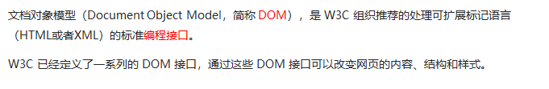

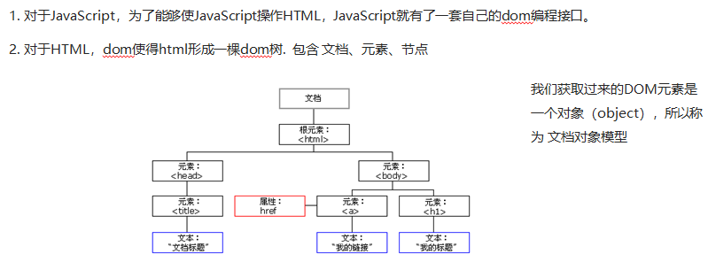


关于dom操作，我们主要针对于元素的操作。主要有创建、增、删、改、查、属性操作、事件操作。

### 1.2.1. 创建

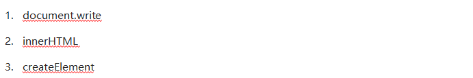

### 1.2.2. 增加

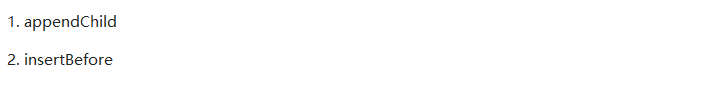

### 1.2.3. 删

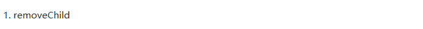

### 1.2.4. 改

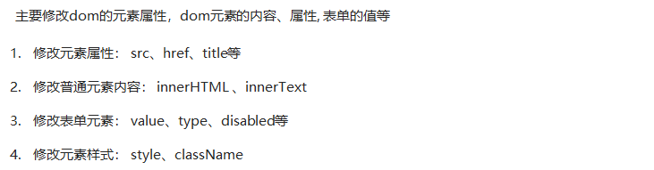

### 1.2.5. 查

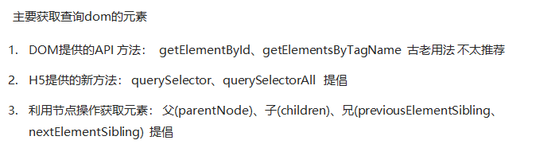

### 1.2.6. 属性操作

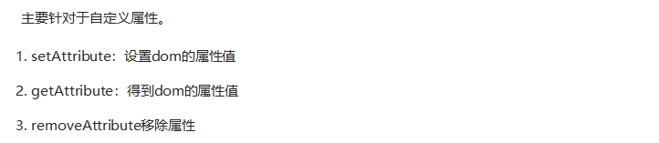

### 1.2.7. 事件操作（重点）

## 1.3. 事件高级

### 1.3.1. 注册事件（2种方式）


### 1.3.2 事件监听

#### addEventListener()事件监听（IE9以后支持）

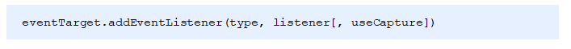

eventTarget.addEventListener()方法将指定的监听器注册到 eventTarget（目标对象）上，当该对象触发指定的事件时，就会执行事件处理函数。


#### attacheEvent()事件监听（IE678支持）

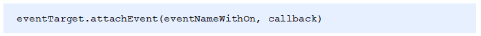

​	eventTarget.attachEvent()方法将指定的监听器注册到 eventTarget（目标对象） 上，当该对象触发指定的事件时，指定的回调函数就会被执行。

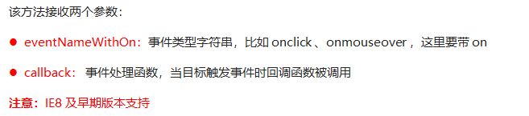

```html
<button>传统注册事件</button>
<button>方法监听注册事件</button>
<button>ie9 attachEvent</button>
<script>
    var btns = document.querySelectorAll('button');
    // 1. 传统方式注册事件
    btns[0].onclick = function() {
        alert('hi');
    }
    btns[0].onclick = function() {
            alert('hao a u');
        }
   // 2. 事件侦听注册事件 addEventListener 
   // (1) 里面的事件类型是字符串 必定加引号 而且不带on
   // (2) 同一个元素 同一个事件可以添加多个侦听器（事件处理程序）
    btns[1].addEventListener('click', function() {
        alert(22);
    })
    btns[1].addEventListener('click', function() {
            alert(33);
    })
    // 3. attachEvent ie9以前的版本支持
    btns[2].attachEvent('onclick', function() {
        alert(11);
    })
</script>
```
#### 事件监听兼容性解决方案

封装一个函数，函数中判断浏览器的类型：

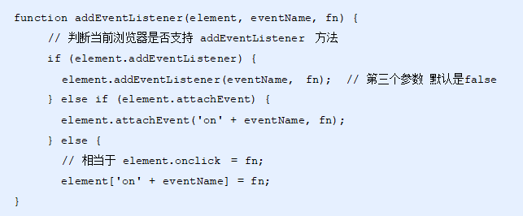

### 1.3.3. 删除事件（解绑事件）

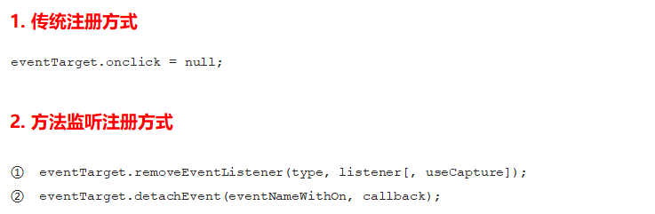

```html
    <div>1</div>
    <div>2</div>
    <div>3</div>
    <script>
        var divs = document.querySelectorAll('div');
        divs[0].onclick = function() {
            alert(11);
            // 1. 传统方式删除事件
            divs[0].onclick = null;
        }
        // 2. removeEventListener 删除事件
        divs[1].addEventListener('click', fn) // 里面的fn 不需要调用加小括号
        function fn() {
            alert(22);
            divs[1].removeEventListener('click', fn);
        }
        // 3. detachEvent
        divs[2].attachEvent('onclick', fn1);

        function fn1() {
            alert(33);
            divs[2].detachEvent('onclick', fn1);
        }
    </script>
```

**删除事件兼容性解决方案 **

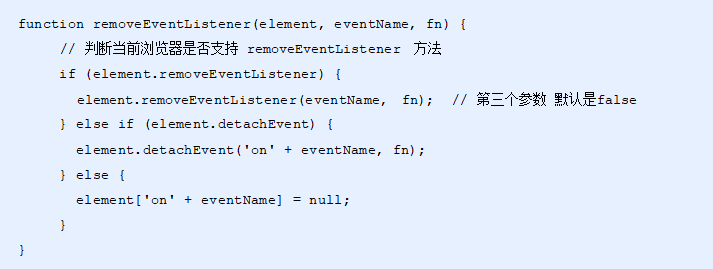

### 1.3.4. DOM事件流

> ```
> html中的标签都是相互嵌套的，我们可以将元素想象成一个盒子装一个盒子，document是最外面的大盒子。
> 当你单击一个div时，同时你也单击了div的父元素，甚至整个页面。
> 
> 那么是先执行父元素的单击事件，还是先执行div的单击事件 ？？？
> ```

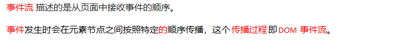

> 比如：我们给页面中的一个div注册了单击事件，当你单击了div时，也就单击了body，单击了html，单击了document。

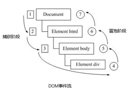

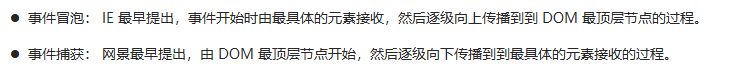

> ```
> 当时的2大浏览器霸主谁也不服谁！
> IE 提出从目标元素开始，然后一层一层向外接收事件并响应，也就是冒泡型事件流。
> Netscape（网景公司）提出从最外层开始，然后一层一层向内接收事件并响应，也就是捕获型事件流。
> 
> 江湖纷争，武林盟主也脑壳疼！！！
> 
> 最终，w3c 采用折中的方式，平息了战火，制定了统一的标准 —--— 先捕获再冒泡。
> 现代浏览器都遵循了此标准，所以当事件发生时，会经历3个阶段。
> ```

DOM 事件流会经历3个阶段： 

1. 捕获阶段

2. 当前目标阶段

3. 冒泡阶段 


​我们向水里面扔一块石头，首先它会有一个下降的过程，这个过程就可以理解为从最顶层向事件发生的最具体元素（目标点）的捕获过程；之后会产生泡泡，会在最低点（ 最具体元素）之后漂浮到水面上，这个过程相当于事件冒泡。 


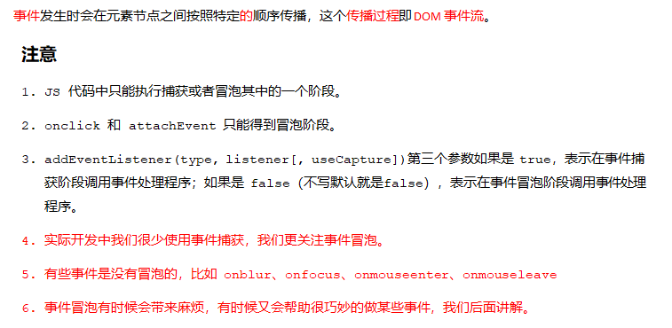

**事件冒泡**

```html
    <div class="father">
        <div class="son">son盒子</div>
    </div>
    <script>
        // onclick 和 attachEvent（ie） 在冒泡阶段触发
        // 冒泡阶段 如果addEventListener 第三个参数是 false 或者 省略 
        // son -> father ->body -> html -> document
        var son = document.querySelector('.son');
		// 给son注册单击事件
        son.addEventListener('click', function() {
            alert('son');
        }, false);
		// 给father注册单击事件
        var father = document.querySelector('.father');
        father.addEventListener('click', function() {
            alert('father');
        }, false);
		// 给document注册单击事件，省略第3个参数
        document.addEventListener('click', function() {
            alert('document');
        })
    </script>
```

**事件捕获**

```html
    <div class="father">
        <div class="son">son盒子</div>
    </div>
    <script>
        // 如果addEventListener() 第三个参数是 true 那么在捕获阶段触发
        // document -> html -> body -> father -> son
         var son = document.querySelector('.son');
		// 给son注册单击事件，第3个参数为true
         son.addEventListener('click', function() {
             alert('son');
         }, true);
         var father = document.querySelector('.father');
		// 给father注册单击事件，第3个参数为true
         father.addEventListener('click', function() {
             alert('father');
         }, true);
		// 给document注册单击事件，第3个参数为true
        document.addEventListener('click', function() {
            alert('document');
        }, true)
    </script>
```

### 1.3.5. 事件对象

#### 什么是事件对象

事件发生后，跟事件相关的一系列信息数据的集合都放到这个对象里面，这个对象就是事件对象。

比如：  

1. 谁绑定了这个事件。

2. 鼠标触发事件的话，会得到鼠标的相关信息，如鼠标位置。

3. 键盘触发事件的话，会得到键盘的相关信息，如按了哪个键。

#### 事件对象的使用

事件触发发生时就会产生事件对象，并且系统会以实参的形式传给事件处理函数。

所以，在事件处理函数中声明1个形参用来接收事件对象。

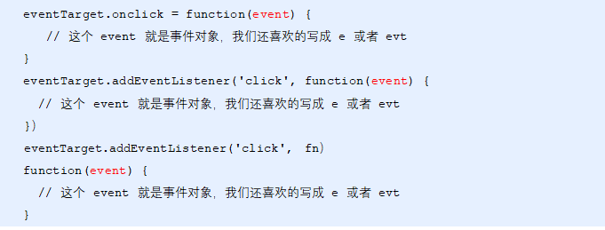

#### 事件对象的兼容性处理

事件对象本身的获取存在兼容问题：

1. 标准浏览器中是浏览器给方法传递的参数，只需要定义形参 e 就可以获取到。

2. 在 IE6~8 中，浏览器不会给方法传递参数，如果需要的话，需要到 window.event 中获取查找。

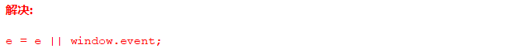

```
只要“||”前面为false, 不管“||”后面是true 还是 false，都返回 “||” 后面的值。
只要“||”前面为true, 不管“||”后面是true 还是 false，都返回 “||” 前面的值。
```

```html
    <div>123</div>
    <script>
        var div = document.querySelector('div');
        div.onclick = function(e) {
                // 事件对象
                e = e || window.event;
                console.log(e);
        }
    </script>
```

#### 事件对象的属性和方法


#### e.target 和 this 的区别

- this 是事件绑定的元素（绑定这个事件处理函数的元素） 。

- e.target 是事件触发的元素。

> ```
> 常情况下terget 和 this是一致的，
> 但有一种情况不同，那就是在事件冒泡时（父子元素有相同事件，单击子元素，父元素的事件处理函数也会被触发执行），
> 	这时候this指向的是父元素，因为它是绑定事件的元素对象，
> 	而target指向的是子元素，因为他是触发事件的那个具体元素对象。
> ```

```html
    <div>123</div>
    <script>
        var div = document.querySelector('div');
        div.addEventListener('click', function(e) {
            // e.target 和 this指向的都是div
            console.log(e.target);
            console.log(this);

        });
    </script>
```

事件冒泡下的e.target和this

```html
    <ul>
        <li>abc</li>
        <li>abc</li>
        <li>abc</li>
    </ul>
    <script>
        var ul = document.querySelector('ul');
        ul.addEventListener('click', function(e) {
              // 我们给ul 绑定了事件  那么this 就指向ul  
              console.log(this); // ul

              // e.target 触发了事件的对象 我们点击的是li e.target 指向的就是li
              console.log(e.target); // li
        });
    </script>
```

### 1.3.6 阻止默认行为

> html中一些标签有默认行为，例如a标签被单击后，默认会进行页面跳转。

```html
    <a href="http://www.baidu.com">百度</a>
    <script>
        // 2. 阻止默认行为 让链接不跳转 
        var a = document.querySelector('a');
        a.addEventListener('click', function(e) {
             e.preventDefault(); //  dom 标准写法
        });
        // 3. 传统的注册方式
        a.onclick = function(e) {
            // 普通浏览器 e.preventDefault();  方法
            e.preventDefault();
            // 低版本浏览器 ie678  returnValue  属性
            e.returnValue = false;
            // 我们可以利用return false 也能阻止默认行为 没有兼容性问题
            return false;
        }
    </script>
```

### 1.3.7 阻止事件冒泡

事件冒泡本身的特性，会带来的坏处，也会带来的好处。

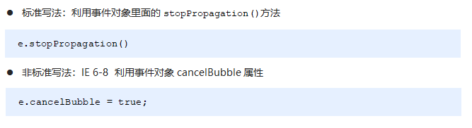

```html
    <div class="father">
        <div class="son">son儿子</div>
    </div>
    <script>
        var son = document.querySelector('.son');
		// 给son注册单击事件
        son.addEventListener('click', function(e) {
            alert('son');
            e.stopPropagation(); // stop 停止  Propagation 传播
            window.event.cancelBubble = true; // 非标准 cancel 取消 bubble 泡泡
        }, false);

        var father = document.querySelector('.father');
		// 给father注册单击事件
        father.addEventListener('click', function() {
            alert('father');
        }, false);
		// 给document注册单击事件
        document.addEventListener('click', function() {
            alert('document');
        })
    </script>
```

**阻止事件冒泡的兼容性处理**

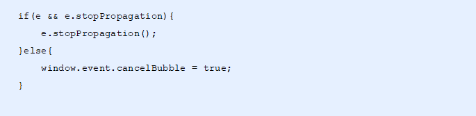

### 1.3.8 事件委托

事件冒泡本身的特性，会带来的坏处，也会带来的好处。

#### 什么是事件委托

```
把事情委托给别人，代为处理。
```

事件委托也称为事件代理，在 jQuery 里面称为事件委派。

> 说白了就是，不给子元素注册事件，给父元素注册事件，把处理代码在父元素的事件中执行。


**生活中的代理：**

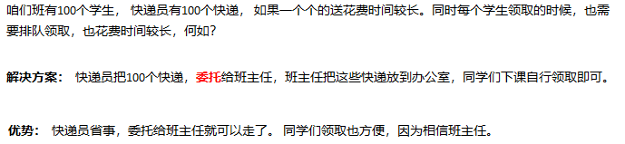

**js事件中的代理：**

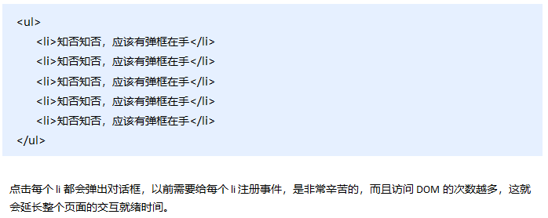

#### 事件委托的原理

​	给父元素注册事件，利用事件冒泡，当子元素的事件触发，会冒泡到父元素，然后去控制相应的子元素。

#### 事件委托的作用

- 我们只操作了一次 DOM ，提高了程序的性能。

- 动态新创建的子元素，也拥有事件。

```html
    <ul>
        <li>知否知否，点我应有弹框在手！</li>
        <li>知否知否，点我应有弹框在手！</li>
        <li>知否知否，点我应有弹框在手！</li>
        <li>知否知否，点我应有弹框在手！</li>
        <li>知否知否，点我应有弹框在手！</li>
    </ul>
    <script>
        // 事件委托的核心原理：给父节点添加侦听器， 利用事件冒泡影响每一个子节点
        var ul = document.querySelector('ul');
        ul.addEventListener('click', function(e) {
            // e.target 这个可以得到我们点击的对象
            e.target.style.backgroundColor = 'pink';
        })
    </script>
```

## 1.4. 常用鼠标事件


### 1.4.1 案例：禁止选中文字和禁止右键菜单

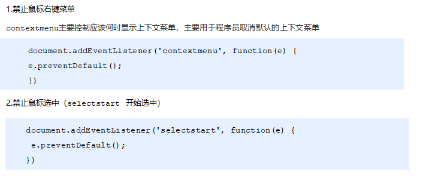

```html
<body>
    我是一段不愿意分享的文字
    <script>
        // 1. contextmenu 我们可以禁用右键菜单
        document.addEventListener('contextmenu', function(e) {
                e.preventDefault();
        })
        // 2. 禁止选中文字 selectstart
        document.addEventListener('selectstart', function(e) {
            e.preventDefault();
        })
    </script>
</body>
```

### 1.4.2 鼠标事件对象


### 1.4.3 获取鼠标在页面的坐标

```html
    <script>
        // 鼠标事件对象 MouseEvent
        document.addEventListener('click', function(e) {
            // 1. client 鼠标在可视区的x和y坐标
            console.log(e.clientX);
            console.log(e.clientY);
            console.log('---------------------');

            // 2. page 鼠标在页面文档的x和y坐标
            console.log(e.pageX);
            console.log(e.pageY);
            console.log('---------------------');

            // 3. screen 鼠标在电脑屏幕的x和y坐标
            console.log(e.screenX);
            console.log(e.screenY);

        })
    </script>
```

### 1.4.4 案例：跟随鼠标的天使

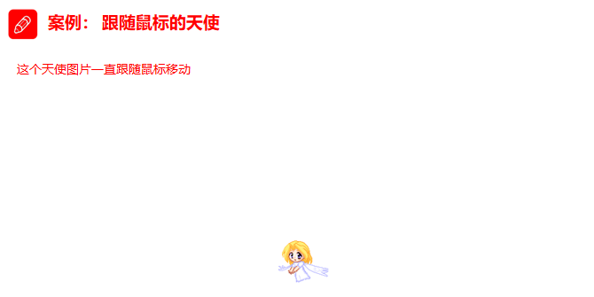

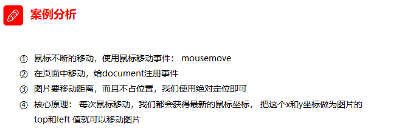

```html
    
    <script>
        var pic = document.querySelector('img');
        document.addEventListener('mousemove', function(e) {
        	// 1. mousemove只要我们鼠标移动1px 就会触发这个事件
        	// 2.核心原理： 每次鼠标移动，我们都会获得最新的鼠标坐标， 
            // 把这个x和y坐标做为图片的top和left 值就可以移动图片
        	var x = e.pageX;
        	var y = e.pageY;
        	console.log('x坐标是' + x, 'y坐标是' + y);
        	//3 . 千万不要忘记给left 和top 添加px 单位
        	pic.style.left = x - 50 + 'px';
        	pic.style.top = y - 40 + 'px';
    	});
    </script>
```

