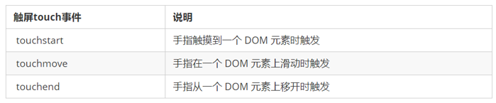

## 1.1. 触屏事件

### 1.1.1 触屏事件概述

移动端浏览器兼容性较好，我们不需要考虑以前 JS 的兼容性问题，可以放心的使用原生 JS 书写效果，但是移动端也有自己独特的地方。比如触屏事件 touch（也称触摸事件），Android 和 IOS 都有。touch 对象代表一个触摸点。触摸点可能是一根手指，也可能是一根触摸笔。触屏事件可响应用户手指（或触控笔）对屏幕或者触控板操作。

常见的触屏事件如下：



### 1.1.2 触摸事件对象（TouchEvent）

TouchEvent 是一类描述手指在触摸平面（触摸屏、触摸板等）的状态变化的事件。这类事件用于描述一个或多个触点，使开发者可以检测触点的移动，触点的增加和减少，等等

touchstart、touchmove、touchend 三个事件都会各自有事件对象。

触摸事件对象重点我们看三个常见对象列表：


> 因为平时我们都是给元素注册触摸事件，所以重点记住 targetTocuhes

### 1.1.3  移动端拖动元素

1.  touchstart、touchmove、touchend 可以实现拖动元素
2.  但是拖动元素需要当前手指的坐标值 我们可以使用  targetTouches[0] 里面的pageX 和 pageY 
3.  移动端拖动的原理：    手指移动中，计算出手指移动的距离。然后用盒子原来的位置 + 手指移动的距离
4.  手指移动的距离：  手指滑动中的位置 减去  手指刚开始触摸的位置

拖动元素三步曲：

（1） 触摸元素 touchstart： 获取手指初始坐标，同时获得盒子原来的位置

（2） 移动手指 touchmove： 计算手指的滑动距离，并且移动盒子

（3） 离开手指 touchend:

> **注意： 手指移动也会触发滚动屏幕所以这里要阻止默认的屏幕滚动 e.preventDefault();**

## 1.2. 移动端常见特效

### 1.2.1 案例: 移动轮播图

`移动端轮播图功能和基本PC端一致。`

1. 可以自动播放图片
2. 手指可以拖动播放轮播图

### 1.2.2. 案例分析:

1. 自动播放功能

2. 开启定时器

3. 移动端移动，可以使用translate 移动

4. 想要图片优雅的移动，请添加过渡效果.jpg)


1. 自动播放功能-无缝滚动

2. 注意，我们判断条件是要等到图片滚动完毕再去判断，就是过渡完成后判断

3. 此时需要添加检测过渡完成事件  transitionend 

4. 判断条件：如果索引号等于 3 说明走到最后一张图片，此时 索引号要复原为 0

5. 此时图片，去掉过渡效果，然后移动

6. 如果索引号小于0， 说明是倒着走， 索引号等于2 

7. 此时图片，去掉过渡效果，然后移动

   .jpg)

## 1.2.3 classList 属性

classList属性是HTML5新增的一个属性，返回元素的类名。但是ie10以上版本支持。

该属性用于在元素中添加，移除及切换 CSS 类。有以下方法

**添加类：**

element.classList.add（’类名’）；

```javascript
focus.classList.add('current');
```

**移除类：**

element.classList.remove（’类名’）;

```javascript
focus.classList.remove('current');
```

**切换类：**

element.classList.toggle（’类名’）;

```javascript
focus.classList.toggle('current');
```

`注意:以上方法里面，所有类名都不带点`

### 1.2.4. 案例分析

1. 小圆点跟随变化效果

2. 把ol里面li带有current类名的选出来去掉类名 remove

3. 让当前索引号的小li 加上 current   add

4. 但是，是等着过渡结束之后变化，所以这个写到 transitionend 事件里面

   .jpg)


1. 手指滑动轮播图

2. 本质就是ul跟随手指移动，简单说就是移动端拖动元素

3. 触摸元素touchstart：获取手指初始坐标

4. 移动手指touchmove：计算手指的滑动距离，并且移动盒子

5. 离开手指touchend: 根据滑动的距离分不同的情况

6. 如果移动距离小于某个像素  就回弹原来位置

7. 如果移动距离大于某个像素就上一张下一张滑动。

8. 滑动也分为左滑动和右滑动判断的标准是 移动距离正负 如果是负值就是左滑 反之右滑 

9. 如果是左滑就播放下一张 （index++）

10. 如果是右滑就播放上一张  (index--)

.jpg)

.jpg)

### 1.3.1. 案例：返回顶部

当页面滚动某个地方，就显示，否则隐藏

点击可以返回顶部

### 1.3.2.案例分析

1. 滚动某个地方显示
2. 事件：scroll页面滚动事件  
3. 如果被卷去的头部（window.pageYOffset ）大于某个数值
4. 点击，window.scroll(0,0) 返回顶部

.jpg)

## 1.4. click 延时解决方案

移动端 click 事件会有 300ms 的延时，原因是移动端屏幕双击会缩放(double tap to zoom) 页面。

解决方案：

1. 禁用缩放。 浏览器禁用默认的双击缩放行为并且去掉300ms 的点击延迟。

```html
  <meta name="viewport" content="user-scalable=no">
```

2.利用touch事件自己封装这个事件解决300ms 延迟。 

原理就是：

1.  当我们手指触摸屏幕，记录当前触摸时间
2.  当我们手指离开屏幕， 用离开的时间减去触摸的时间
3.  如果时间小于150ms，并且没有滑动过屏幕， 那么我们就定义为点击

代码如下:

```html
//封装tap，解决click 300ms 延时
function tap (obj, callback) {
        var isMove = false;
        var startTime = 0; // 记录触摸时候的时间变量
        obj.addEventListener('touchstart', function (e) {
            startTime = Date.now(); // 记录触摸时间
        });
        obj.addEventListener('touchmove', function (e) {
            isMove = true;  // 看看是否有滑动，有滑动算拖拽，不算点击
        });
        obj.addEventListener('touchend', function (e) {
            if (!isMove && (Date.now() - startTime) < 150) {  // 如果手指触摸和离开时间小于150ms 算点击
                callback && callback(); // 执行回调函数
            }
            isMove = false;  //  取反 重置
            startTime = 0;
        });
}
//调用  
  tap(div, function(){   // 执行代码  });

```

3. 使用插件。fastclick 插件解决300ms 延迟。 

.jpg)

## 1.5. 移动端常用开发插件

### 1.5.1. 什么是插件

移动端要求的是快速开发，所以我们经常会借助于一些插件来帮我完成操作，那么什么是插件呢？

JS 插件是 js 文件，它遵循一定规范编写，方便程序展示效果，拥有特定功能且方便调用。如轮播图和瀑布流插件。

特点：它一般是为了解决某个问题而专门存在，其功能单一，并且比较小。

我们以前写的animate.js 也算一个最简单的插件

fastclick 插件解决 300ms 延迟。 使用延时

GitHub官网地址： [https://](https://github.com/ftlabs/fastclick)[github.com/ftlabs/fastclick](https://github.com/ftlabs/fastclick)

### 1.5.2. 插件的使用

1.  引入 js 插件文件。

2.  按照规定语法使用。

3.  fastclick 插件解决 300ms 延迟。 使用延时

4.  GitHub官网地址： https://github.com/ftlabs/fastclick

```html
if ('addEventListener' in document) {
            document.addEventListener('DOMContentLoaded', function() {
                       FastClick.attach(document.body);
            }, false);
}
```

### 1.5.3. Swiper 插件的使用

中文官网地址： https://www.swiper.com.cn/ 

1. 引入插件相关文件。
2. 按照规定语法使用

### 1.5.4. 其他移动端常见插件

superslide：http://www.superslide2.com/

iscroll：https://github.com/cubiq/iscroll

### 1.5.5. 插件的使用总结

1.确认插件实现的功能

2.去官网查看使用说明

3.下载插件

4.打开demo实例文件，查看需要引入的相关文件，并且引入

5.复制demo实例文件中的结构html，样式css以及js代码

### 1.5.6. 移动端视频插件 zy.media.js

H5 给我们提供了 video 标签，但是浏览器的支持情况不同。

不同的视频格式文件，我们可以通过source解决。

但是外观样式，还有暂停，播放，全屏等功能我们只能自己写代码解决。

这个时候我们可以使用插件方式来制作。

我们可以通过 JS 修改元素的大小、颜色、位置等样式。

## 1.6. 移动端常用开发框架

### 1.6.1. 移动端视频插件 zy.media.js

框架，顾名思义就是一套架构，它会基于自身的特点向用户提供一套较为完整的解决方案。框架的控制权在框架本身，使用者要按照框架所规定的某种规范进行开发。

插件一般是为了解决某个问题而专门存在，其功能单一，并且比较小。

前端常用的框架有 Bootstrap、Vue、Angular、React 等。既能开发PC端，也能开发移动端

前端常用的移动端插件有 swiper、superslide、iscroll等。

框架： 大而全，一整套解决方案

插件： 小而专一，某个功能的解决方案

### 1.6.2. Bootstrap

Bootstrap 是一个简洁、直观、强悍的前端开发框架，它让 web 开发更迅速、简单。

它能开发PC端，也能开发移动端 

Bootstrap JS插件使用步骤：

1.引入相关js 文件

2.复制HTML 结构

3.修改对应样式

4.修改相应JS 参数

## 1.7. 本地存储

随着互联网的快速发展，基于网页的应用越来越普遍，同时也变的越来越复杂，为了满足各种各样的需求，会经常性在本地存储大量的数据，HTML5规范提出了相关解决方案。

### 1.7.1.本地存储特性

1、数据存储在用户浏览器中

2、设置、读取方便、甚至页面刷新不丢失数据

3、容量较大，sessionStorage约5M、localStorage约20M

4、只能存储字符串，可以将对象JSON.stringify() 编码后存储

### 1.7.2.window.sessionStorage

1、生命周期为关闭浏览器窗口

2、在同一个窗口(页面)下数据可以共享

3、以键值对的形式存储使用

存储数据：

```javascript
sessionStorage.setItem(key, value)
```

获取数据：

```javascript
sessionStorage.getItem(key)
```

删除数据：

```javascript
sessionStorage.removeItem(key)
```

清空数据：(所有都清除掉)

```javascript
sessionStorage.clear()
```

### 1.7.3.window.localStorage

1、声明周期永久生效，除非手动删除 否则关闭页面也会存在

2、可以多窗口（页面）共享（同一浏览器可以共享）

3.  以键值对的形式存储使用

存储数据：

```javascript
localStorage.setItem(key, value)
```

获取数据：

```javascript
localStorage.getItem(key)
```

删除数据：

```javascript
localStorage.removeItem(key)
```

清空数据：(所有都清除掉)

```javascript
localStorage.clear()
```

### 1.7.4.案例：记住用户名

如果勾选记住用户名， 下次用户打开浏览器，就在文本框里面自动显示上次登录的用户名

#### 案例分析

1. 把数据存起来，用到本地存储

2. 关闭页面，也可以显示用户名，所以用到localStorage

3. 打开页面，先判断是否有这个用户名，如果有，就在表单里面显示用户名，并且勾选复选框

4. 当复选框发生改变的时候change事件

5. 如果勾选，就存储，否则就移除

   .jpg)


